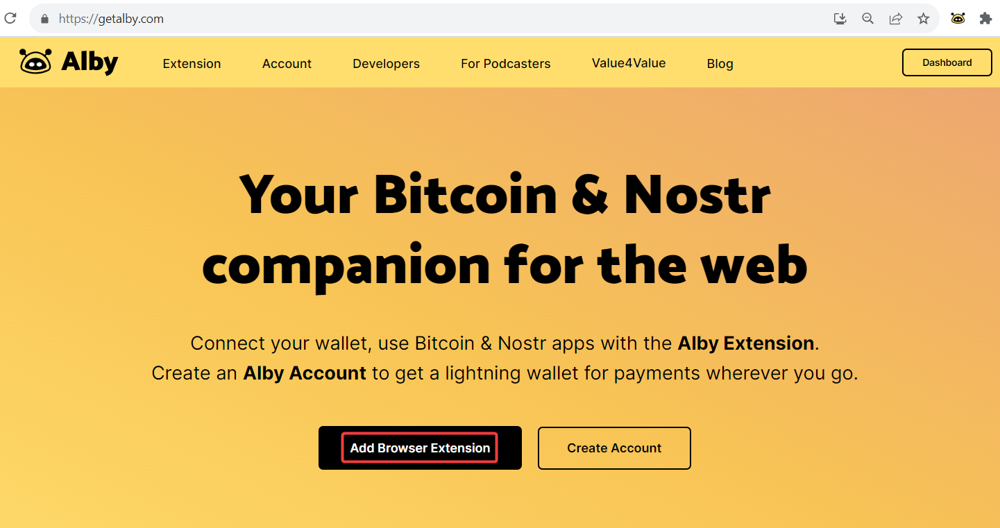
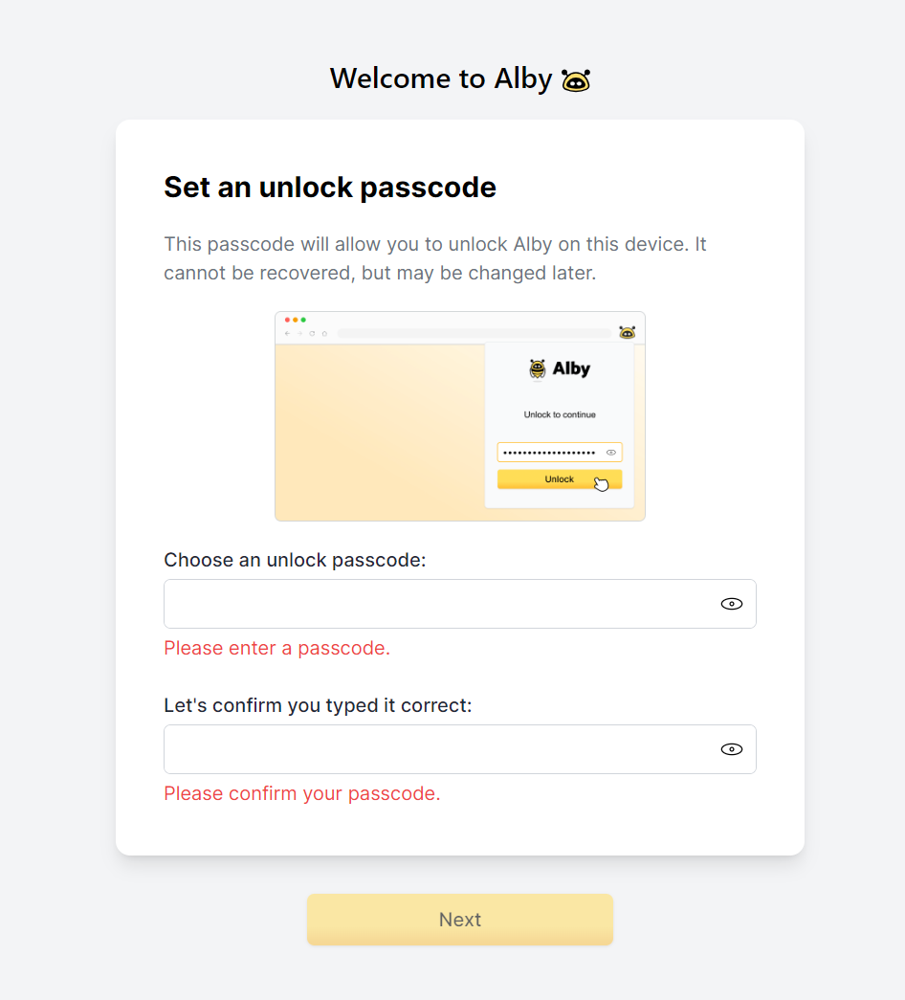
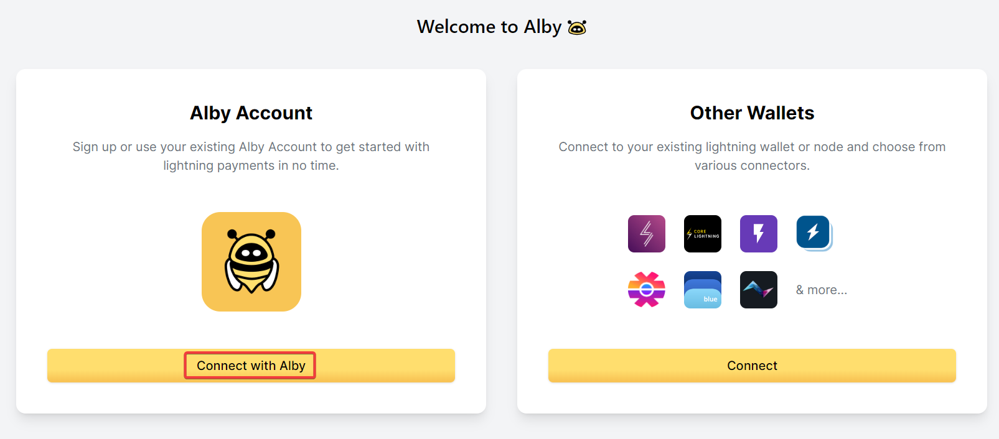
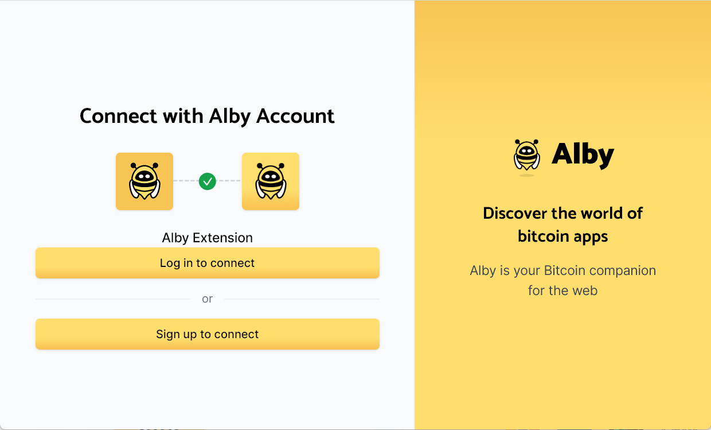

# Alby Browser Extension


You can connect your existing Alby Lightning account (getalby.com/login) to the Alby Browser Extension. The credentials to login to both are the same.&#x20;


**Step 1**: Go to getalby.com and click on 'Add Browser Extension'. You are automatically forwarded to download the browser extension.

<figure><figcaption></figcaption></figure>

**Step 2:** After installing the Browser Extension, please set a unlock passcode and click on 'Next'.


The passcode decrypts your sensitive data locally on your own device.&#x20;


<figure><figcaption></figcaption></figure>

**Step 3a**: Now you can connect any Alby Account if you click on "Connect with Alby"

<figure><figcaption></figcaption></figure>

**Step 3b:** If you already have the browser extension installed and an account connected, you can add another account:&#x20;

* **Open the wallet menu top right hand corner. Click on "Add a new account"**
* **Continue at Step 3a**

<figure><figcaption></figcaption></figure>

**Step 4:** In a new window you can decide to log into an existing account or sign up for a new account.&#x20;

<figure><figcaption></figcaption></figure>

**Step 5:** If you want to log into an existing account you can either choose 'Log in with password' or 'Send a one-time login code


If you want to log into an existing Alby Account, make sure your are already logged into that account on getalby.com.


<figure><figcaption></figcaption></figure>

* Enter the same credentials that you used when you registered your Alby Account on getalby.com&#x20;
* Click on 'Log in'
* This will load your wallet. You are now connected and can start spending your sats on [these websites](https://getalby.com/discover).

.png>)

