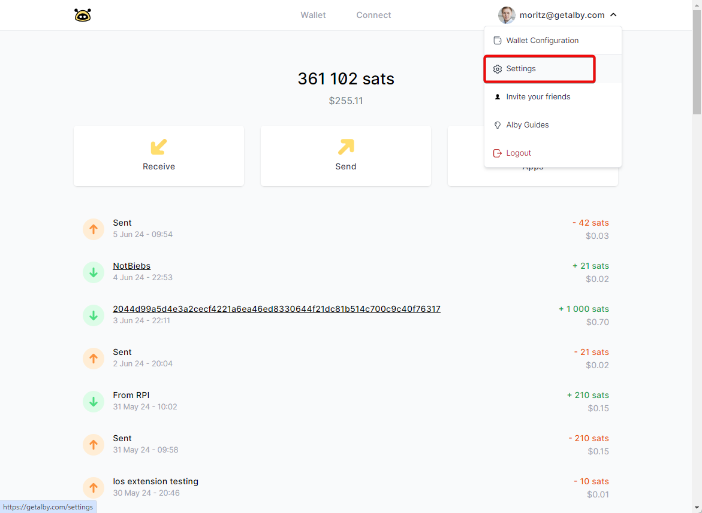
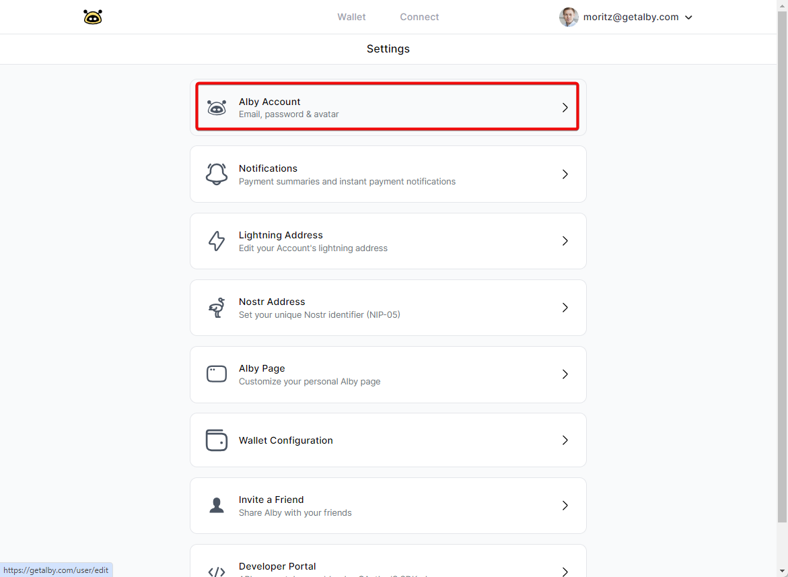
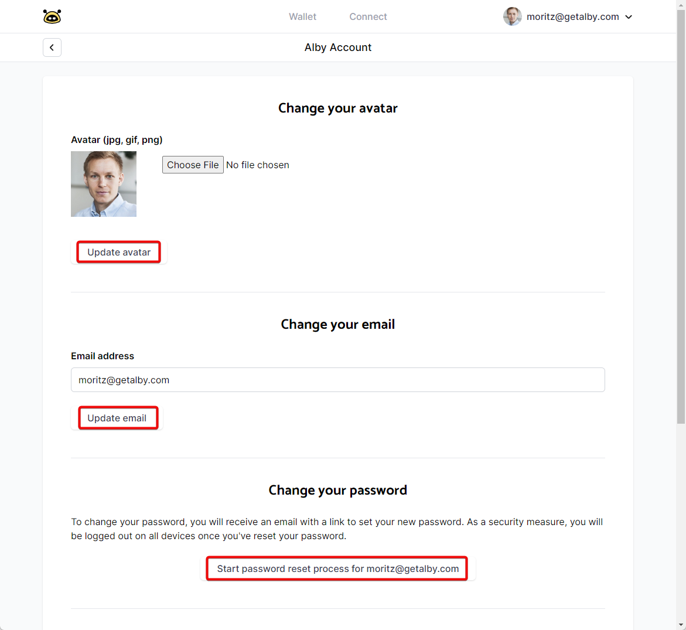

# Email, Password, Currency

Log into your Alby Account on getalby.com by clicking on 'Log in'. Then follow these steps:\
\
**Step 1: Select Settings in the drop down menu**

<figure><figcaption></figcaption></figure>

**Step 2: Select 'Alby Account'**

&#x20;

<figure><figcaption></figcaption></figure>

**Now you can change your avatar for your personal Alby tipping page, email address, password, currency or delete your account if you scroll down.** ✨

<figure><figcaption></figcaption></figure>

