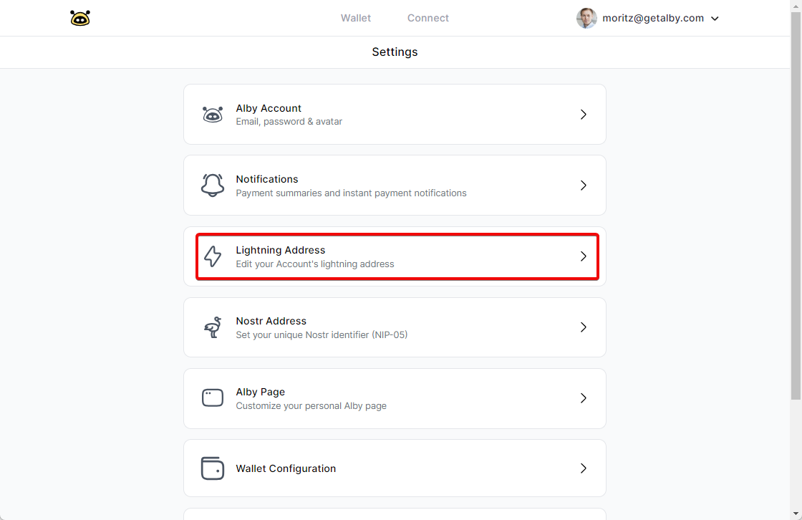

# Lightning Address

A lightning address is a human-readable text that replaces the need for QR Codes to send and receive  bitcoin over the lightning network.

Your lightning address is an important tool for to receive bitcoin payments. It is easy to share and remember. That's why Alby gives you one by default, when you sign up for an account.&#x20;

### How to change and customize your lightning address

Log into your Alby Account on getalby.com by clicking on Dashboard. Then follow these steps:&#x20;

### **Step 1: Select 'Settings' in the drop down menu**

<figure><figcaption></figcaption></figure>

### **Step 2: Select 'Lightning Address'**

<figure><figcaption></figcaption></figure>

### **Step 3: Change your lightning address and click on 'Update'**

Changing your lightning address requires a paid subscription plan. You'll find instructions below.

<figure><figcaption></figcaption></figure>

#### **Congrats! You just updated your lightning address.**


Did you know? The first part of your lightning address also serves as your username.&#x20;

