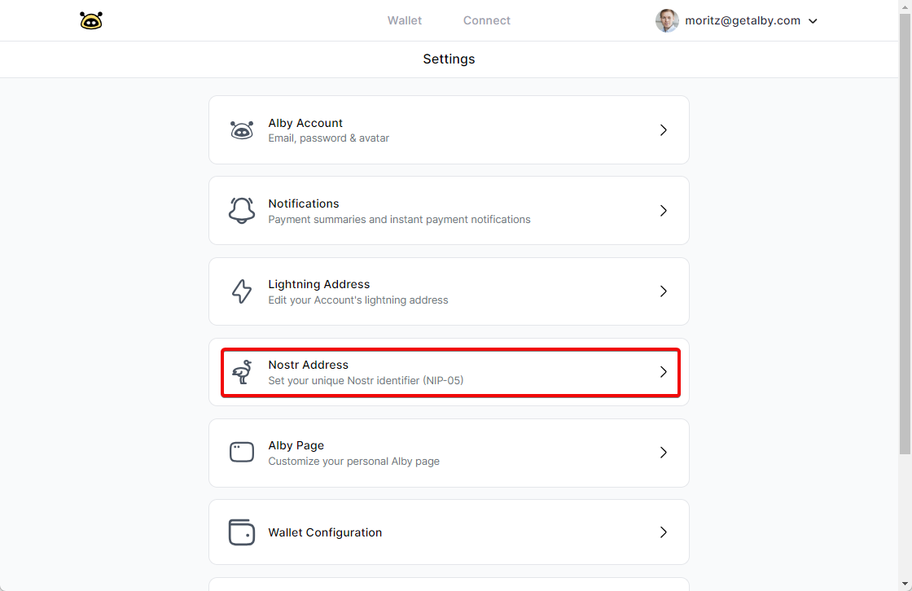

# Nostr Identifier

You can now use your Alby lightning address as your identity on Nostr. Everyone on Nostr can find you based on your Alby lightning address.&#x20;


[Nostr](https://github.com/nostr-protocol/nostr) is an open protocol with the goal to create a censorship-resistant global "social" network. It doesn't rely on any trusted central server and is based on cryptographic keys and signatures. \
Using your Alby lightning address follows the [NIP-05](https://github.com/nostr-protocol/nips) specification.&#x20;


To connect your lightning address to your Nostr profile you have to add your Nostr public key to Alby. If you only want to receive zaps, see the separate guide on [adding your lightning address to Nostr](../faq/how-to-add-my-lightning-address-to-nostr.md).&#x20;

### **Step 1: Select Settings in the drop down menu**

<figure><figcaption></figcaption></figure>

### **Step 2: Select 'Nostr Address'**&#x20;

<figure><figcaption></figcaption></figure>

### **Step 3:  Add your Nostr public key**

<figure><figcaption></figcaption></figure>

**Click on 'Update Nostr public key' and your are done!** \
**Everybody can find you with your easy to remember lightning address.** ✨&#x20;
