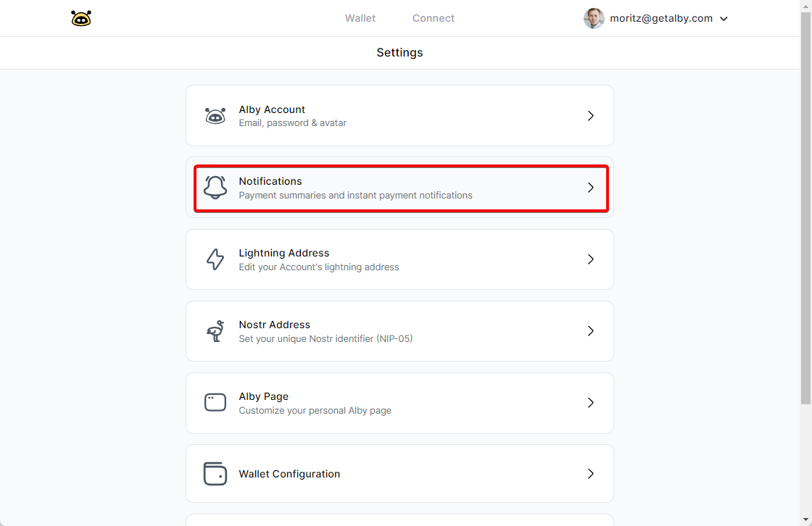
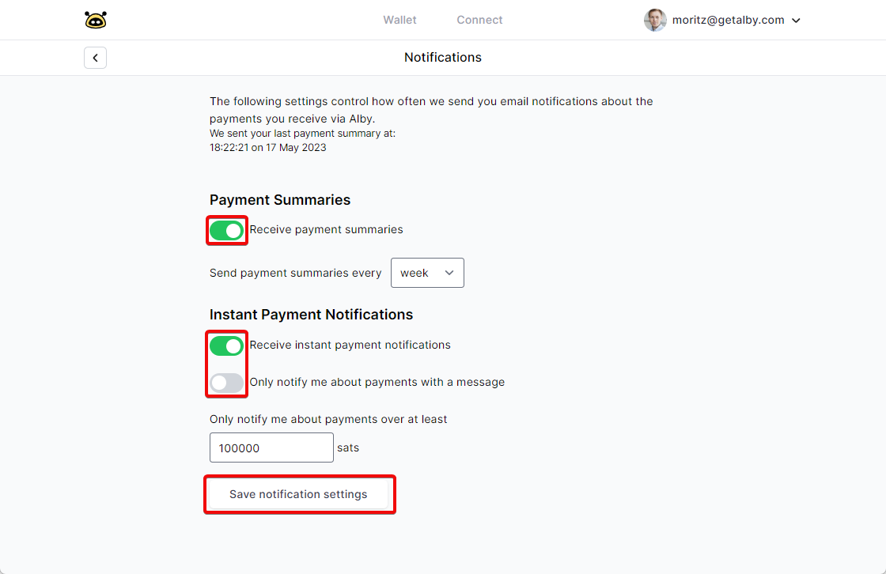

# Notifications and reports

Log into your Alby Account on getalby.com by clicking on 'Log In'. Then follow these steps:&#x20;

### **Step 1: Select 'Settings' in the drop down menu**

<figure><figcaption></figcaption></figure>

### **Step 2: Select 'Notifications'**

<figure><figcaption></figcaption></figure>

### **Step 2**: **Change the toggle if you want to receive payment summaries and payment notifications**

<figure><figcaption></figcaption></figure>

You can even define the time interval and minimum amount to receive notifications. ✌️
