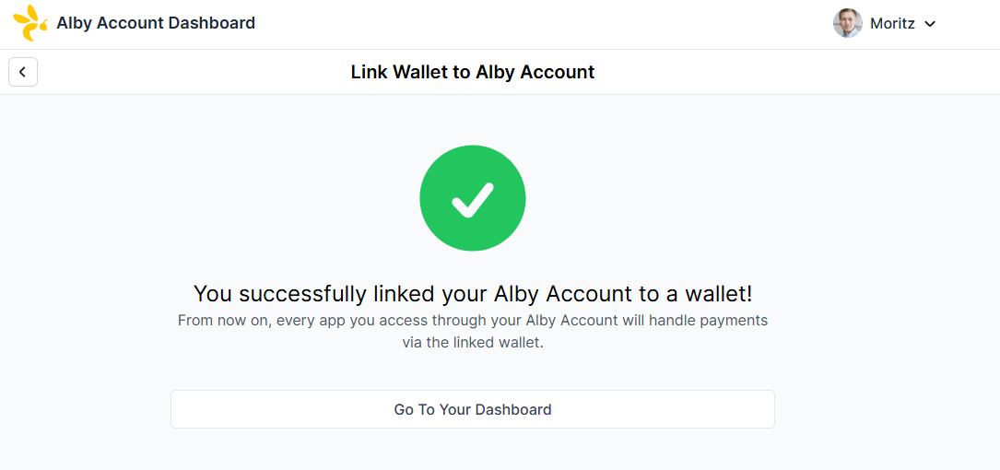

# 🔗 Link other bitcoin wallet

Sending and receiving bitcoin on the lightning network requires a lightning wallet. Your Alby Account adds aditional features to your wallet, but is not a wallet itself.\
&#x20;Watch the video below to learn how to connect your wallet to an Alby account using Nostr Wallet Connect ([NWC](https://nwc.dev/)) in seconds.


&#x20;**Nostr Wallet Connect (NWC)** is Alby's standard protocol for connecting your lightning node or wallet to your Alby Account. It enables secure, permissioned connections to apps and services.


### **1. Log into your Alby Account**

Visit www.getalby.com and log into your Alby Account: getalby.com -> click on "Log In"

<figure><figcaption></figcaption></figure>

### **2. Select the drop down menu and click on "Wallet Configuration"**

<figure><figcaption></figcaption></figure>

### **3. Click on ‘Link Your Own Wallet’**

<figure><figcaption></figcaption></figure>

### **4.Select Nostr Wallet Connect**

<figure><figcaption></figcaption></figure>

### 5. Paste in your NWC Connection Secret.&#x20;

Your NWC Connection Secret looks like: "_nostr+walletconnect://cf6fb0..."_

<figure><figcaption></figcaption></figure>

<figure><figcaption></figcaption></figure>

**Congratulations!** You have successfully linked your node. You can now start managing your funds directly through your Alby Account.
