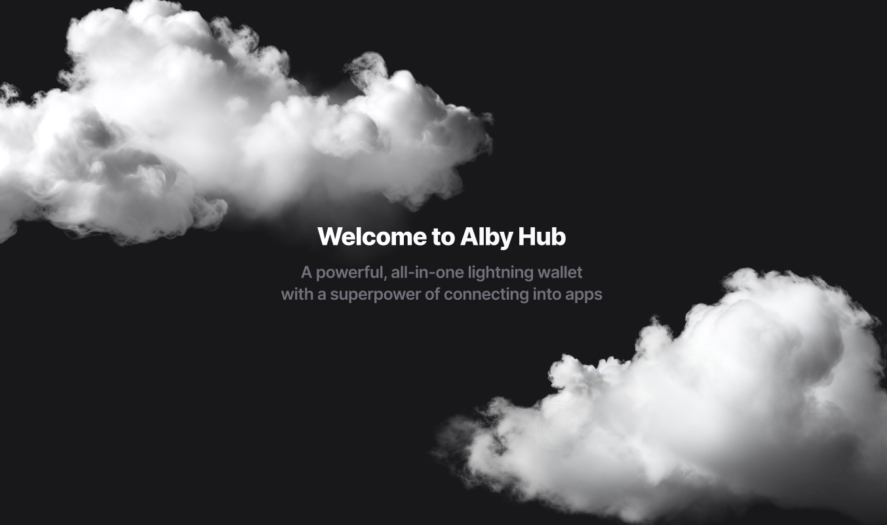

# ℹ️ Introduction

<figure><figcaption>
Alby Hub, your self-custodial wallet.
</figcaption></figure>

### **Your Benefits** 🌟

* **Easiness**: Running your own node has never been easier
* **Ownership**: 24/7 online wallet with a lightning address and more cool features&#x20;
* **Connectivity**: Plug-in your Hub for self-custodial in-app payments anywhere 

### **Feature overview** 🛠️

* Bitcoin onchain and lightning deposits & withdrawals
* Sub-wallets for family and friends
* App marketplace
* In-app BTC purchases via cards and bank transfers
* Powers the Alby Browser Extension and Alby Go mobile app
* Developer APIs and agent Skills

#### Running Alby Hub is a walk in the park with the Alby's cloud hosting service:&#x20;

* One click set up process
* Always online to receive payments 24/7
* Priority support service

Alternatively, you can install Alby Hub on a server of your choice, your desktop computer, or a simple mini-computer (e.g., Raspberry Pi) and run it from your home.

### Would you like to become self-sovereign, too?

Book your personal onboarding session [here](https://cal.com/getalby/alby-hub-onboarding) ☎️ or continue to:


[getting-started.md](getting-started.md)


***

_Alby Hub was created with a lot of effort, love, and the vision of a better world of payments with bitcoin. We’re grateful for running your own Hub and supporting our work._

_Best regards, Your Alby Team 💛🐝_
