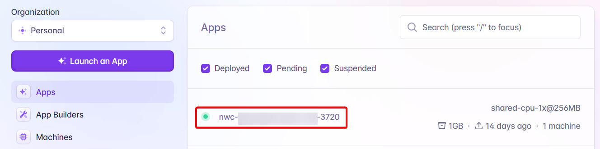
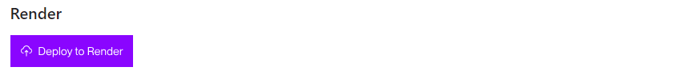

# ☁️ Other Cloud Options

You can find all releases, script binaries and install scripts of Alby Hub on [GitHub](https://github.com/getAlby/hub?tab=readme-ov-file#deploy-it-yourself). \
\
To make the deployment of Alby Hub in the cloud as easy as possible, find guides and 1-click deploy options below 👇

## Overview

* [Fly.io](other-cloud-options.md#fly.io)
* [Nodana](other-cloud-options.md#nodana)
* [Render](other-cloud-options.md#render)

## Fly.io

Fly is a popular micro-VM hosting platform.&#x20;

<details>

<summary>How to use Fly.io to run Alby Hub</summary>


At Alby we are giving you the possibility to connect your own bitcoin lightning node to your [Alby Account](https://getalby.com/#account). To  make it easier to run the node we are using a service to decouple the signing of the transactions from the node. This guide explains how you can self-host the signer app to send and receive payments in a sovereign way. Your lightning node will be independently deployed by Greenlight.

#### Step 1: Create an account on Fly.io and add your credit card details (for free).&#x20;

Fly.io offers a free tier which just provides enough compute resources to host your signer app for your own lightning node. Your card won't be charged as long as you only use your account to host the app. &#x20;

#### Step 2: Install the flyctl&#x20;

Have a look at [this page](https://fly.io/docs/hands-on/install-flyctl/) for Windows, macOS and Linux

#### Step 3: Sign into your fly account via the CLI

To sign in, run

<pre><code><strong>fly auth login
</strong></code></pre>

When your browser opens to the Fly.io sign-in screen, enter your user name and password to sign in.

#### Step 4: Save the config file


Change the name 'Alby-nwc' to a custom name. For example: 'I-run-AlbyHub'


```
# fly.toml app configuration file generated for nwc

app = 'Alby-nwc'
primary_region = 'lax'
swap_size_mb = 2048

[build]
  image = 'ghcr.io/getalby/hub:latest'

[env]
  DATABASE_URI = '/data/nwc.db'
  WORK_DIR = '/data'

[[mounts]]
  source = 'nwc_data'
  destination = '/data'
  initial_size = '1'
  auto_extend_size_threshold = 80
  auto_extend_size_increment = "1GB"
  auto_extend_size_limit = "5GB"

[http_service]
  internal_port = 8080
  force_https = true
  auto_stop_machines = false
  auto_start_machines = true
  min_machines_running = 0
  processes = ['app']

[[vm]]
  cpu_kind = 'shared'
  cpus = 1
  memory = '512mb'
```

#### Step 5: Launch the app

To launch the signer app, run

<pre><code><strong>fly launch
</strong></code></pre>

Make sure you run this command in the directory where you store the config file. &#x20;

The cli might ask you:\
Would you like to copy its configuration to the new app? **Yes**\
Do you want to tweak these settings before proceeding? **No**\
Create .dockerignore from 1 .gitignore files? **No**

If you see: `Watch your deployment at  https://fly.io/apps/....`the app has been deployed successfully.

#### Step 6: Access the app

Log into your Fly.io account and you see the new app in the 'Apps' view.&#x20;

<figure><figcaption></figcaption></figure>

Click on the app to access it on your browser.

#### Step 7: Set up Alby Hub

Click on "Get Started"

<figure><figcaption></figcaption></figure>

### How to update Alby Hub on Fly.io

In Powershell on Windows, navigate to the directory of your fly.toml with `cd [directory path]`. Then type `fly deploy` in Powershell. \
You'll see further information printed in Powershell.&#x20;


**Congrats you successfully deployed and set up your own lightning node.**&#x20;


</details>

## Nodana

Deploy Alby Hub on Nodana with one click. No personal details required. Start [here](https://nodana.io/).

## Render

You can use the one-click install button for the [Render](https://render.com/) cloud platform available [here](https://github.com/getAlby/hub?tab=readme-ov-file#deploy-it-yourself).

<figure><figcaption><p>One-click install button for <a href="https://render.com/">Render</a></p></figcaption></figure>

