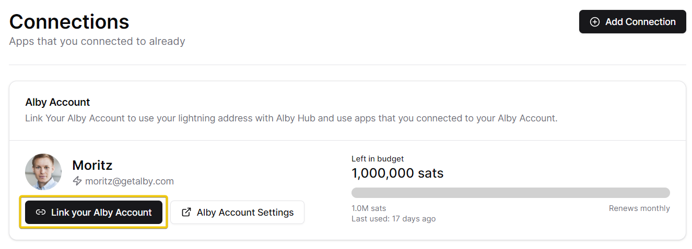
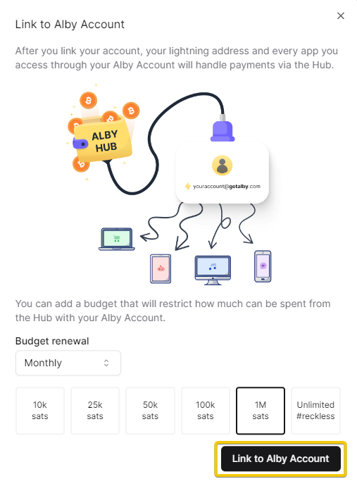
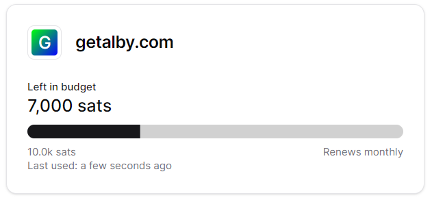
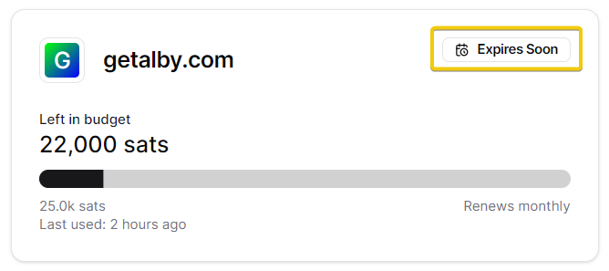
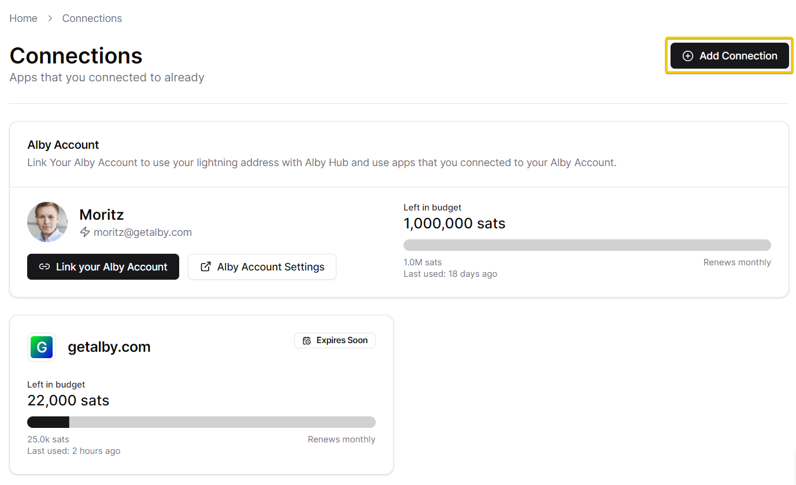
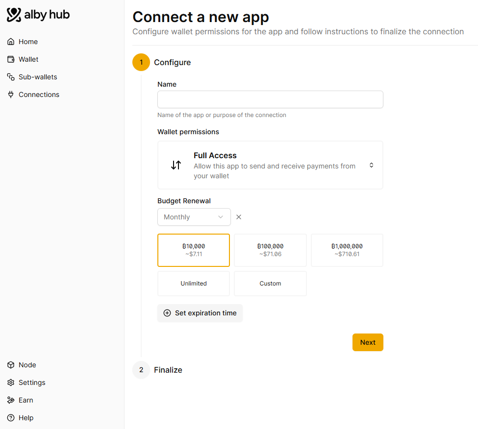
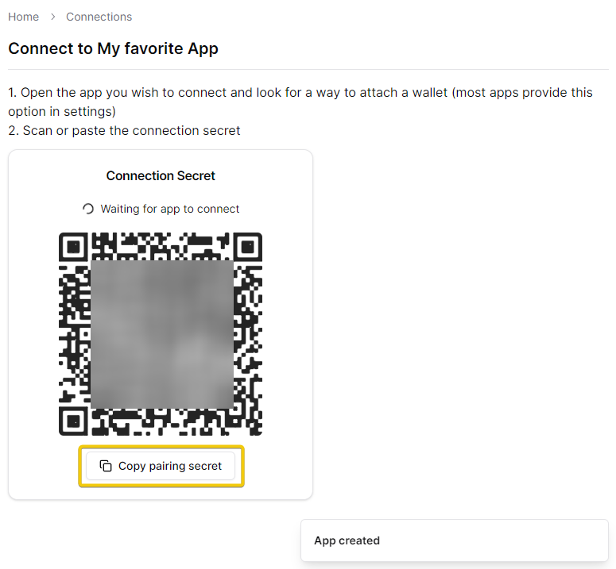

# 🔗 App Connections

The times of depositing funds in 3rd party apps are over. Let your wallet be your hub for payments and connect it to dozens of apps. You remain in control over your funds with your Alby Hub all the time.&#x20;

**Outline**

1. [Your first connections: "Alby Account" important](./#your-first-and-one-of-your-most-important-connections-alby-account)
2. [Connection window explained](./#connection-window-explained)
3. [How to connect apps](./#how-to-connect-apps)

## Your first connection: "Alby Account" (important)

### 1. Navigate to the "Connections" page

When you are in the process of setting up your Hub you see the following page:

<figure><figcaption>
Connections page in Alby Hub
</figcaption></figure>


**Linking your Hub with your Alby Account is important for the following reasons:**

* **Get all Alby Account features**: lighting address  (e.g. personal@getalby.com for your own node), Nostr identity, podcasting 2.0, payment notifications and more to come.
* **Use your Alby Hub on all apps connected** with an Alby Account: Alby Browser Extension, podcasting apps, etc.  -> [Guides](https://app.gitbook.com/s/WKqqWqKEAO8XHGTjzhEl/connect-to-apps) 🔎
* **Pay for your plan**: As a user you may receive premium services that help you run your Hub. We use this link to your Hub to deduct payments according to the selected plan.&#x20;


### 2. Link your Alby Account

Click on "Link your Alby Account"

<figure><figcaption>
Link your Alby Account to your Hub
</figcaption></figure>

### 3. Define the budget, renewal interval and click on "Link to Alby Account"

<figure><figcaption></figcaption></figure>

**Congratulations 🎉**\
You see a green button indicating that you successfully linked your Alby Account

<figure><figcaption></figcaption></figure>

You also see a new window showing the connection. It shows the left budget, that is available to spend through your Alby Account  (i.e. 1,000,000 sats), the renewal period of the budget (i.e. monthly) and when it was used for the last time (i.e. a minute ago)

Now, payments from the Alby Browser Extension or to your Alby lightning address go directly into your own wallet.&#x20;


Please check back regularly whether your Alby Account is still linked. We will help you by sending emails if we detect errors.


## Connection window explained

A brand new connection looks like this:

<figure><figcaption>
Connected app in Alby Hub
</figcaption></figure>

### Title

This is the name of the App Connection, which you can define by yourself. Here it is: getalby.com&#x20;

### Budget

By connecting an app to your Hub, you are authorizing the app to make and receive payments on your behalf. That's great because you can pay directly in every connected app without having to switch apps. Before you had to stop using the app, navigate to your wallet app and execute a payment there.&#x20;

To ensure 3rd party apps cannot access all your lightning balance, you are able to set budgets. These budgets only refer to the according app connection.&#x20;

In this case you authorize your Alby Account to make payments of 1,000,000 in total. That sounds a lot, but keep in mind, that you use the Alby Browser Extension and a few more apps with your Alby Account.&#x20;

### Budget Visualization

Each time you pay with or in a connected app, you pay out of your own Hub. As a consequence your "Left in budget" amount is reduced. For instance if you sent 3,000 sats out of a total budget of 10,000 sats, there are only 7,000 sats left to send.

<figure><figcaption>
Budget visualization
</figcaption></figure>

### Budget Renewal

This part defines the period when your budget renews. In this case the budget renews on a monthly basis. You define the period according to your preferences. &#x20;

### Activity

Whenever you use the connection  (e.g. you send a payment)  an activity is recorded and added to the connection window. In this case we just paid some sats a few seconds ago.&#x20;

### Badges: "Expires Soon" and "Expired"

<figure><figcaption>
Connection Expiration
</figcaption></figure>

When you create an app connection you can set an expiration date. That's why app connections can expire.&#x20;

You'll see an "Expires Soon" badge when a certain app connection is about to expire. When the initial connection date is passed you'll see an "Expired" badge. The connection is now inactive and set permissions are not working anymore (e.g. send a payment)

In both cases it is time to update your connection by clicking on the window, selecting "Edit", change the "Connection expiration" date and click on "Save".&#x20;

## How to connect apps

To connect your Hub with an app of your choice go through the following steps:

#### 1. Navigate to 'Connections' and click on "Add Connection"

<figure><figcaption>
Add connection
</figcaption></figure>

#### 2. Choose wallet permissions, budget and expiration time

You can leave the default name and Full Access. You can also customize the permissions and the name, budget, budget renewal, the expiration date (optional). Then click on "Next".

<figure><figcaption></figcaption></figure>

Awesome! Your app connection was created!

#### 3. Copy and paste your pairing secret in the desired app or just scan it to finish the process.

<figure><figcaption>
App connection created
</figcaption></figure>

**Congrats! You successfully connect your Hub to an app while staying in control of your funds. 💪**

## How to edit app connections

Simply find the app connection window of the specific app, click on it and select "Edit" in the window displaying the connection details.&#x20;

<figure><figcaption>
Edit an app connection
</figcaption></figure>


You can change permissions, budget, budget renewal and expiration time. Click on "Save" and you  updated the connection.  **🎉**


***

_Thank you for stopping by!_\
_This section was created with contributions from Jean-Paul, Tomek & Moritz_
