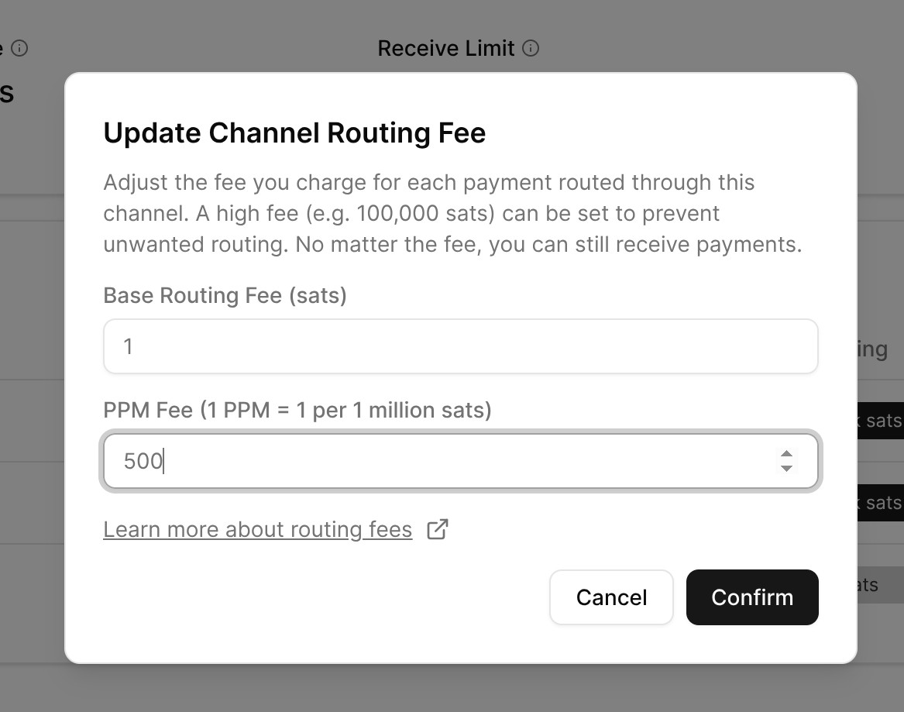

# How can I change routing fees?

Routing fees in the lightning network are paid to node operators for routing transactions between users. Some nodes can operate as routing nodes and earn bitcoin for their services.

## Changing the routing fee

On the "Node" page, click on the three dots on the right side of the channel, then select "Set Routing Fee." The amount shown is in milli-satoshis. By default when you open a channel with Alby Hub, the number is set to 100,000 satoshis.

Routing fees can only be changed on public channels. If you only open private channels, you will not see the option to change the routing fees.&#x20;

If you would like to route, you should set a competitive routing fee. If you don't want to route payments through your public channels, it is recommended to leave the routing fee unchanged.&#x20;

<figure><figcaption>
Alby Hub Node page. Click on the three dots to change the routing fees.
</figcaption></figure>

<figure><figcaption>
Update channel routing fees
</figcaption></figure>


You can see stats of your routing activitiy on the Home page in the "Stats for Nerds" section of your Hub.


