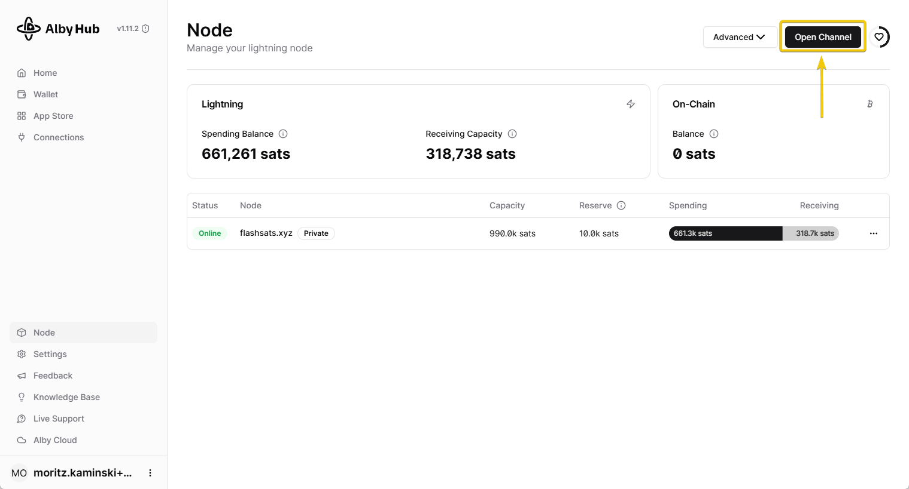
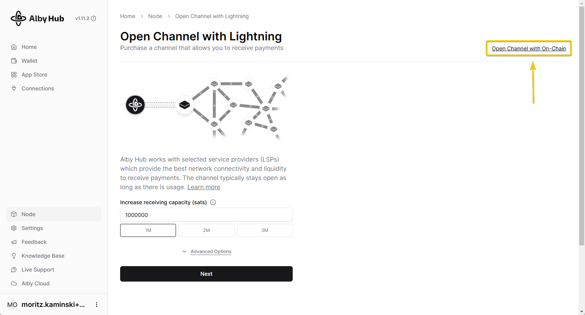

# How to open a channel to a custom node or any node on the network?

### Overview

1. [What is a Lightning channel and a custom node?](how-to-open-a-channel-to-a-custom-node-or-any-node-on-the-network.md#what-is-a-lightning-channel)
2. [Opening a custom channel](how-to-open-a-channel-to-a-custom-node-or-any-node-on-the-network.md#opening-a-custom-channel)
3. [Waiting for the channel to open](how-to-open-a-channel-to-a-custom-node-or-any-node-on-the-network.md#5-waiting-for-the-channel-to-open)

***

### What is a Lightning channel?

A channel in the Lightning Network is a connection between two participants (also called "peers"), starting with one party locking up some Bitcoin in an on-chain transaction that remains unsettled. This allows the two participants to send satoshis back and forth an unlimited number of times with very fast speeds and low fees.

More details on what exactly are Lightning Network channels

While this special on-chain transaction is unsettled, both parties can instantly send Bitcoin back and forth within the channel without broadcasting each transaction to the entire Bitcoin mainnet. This results in rapid and inexpensive transfers. Additionally, they can send satoshis to anyone else connected to them through other channels, creating a network of interconnected nodes withs channels between them, known as the Lightning Network. When the participants decide to close their channel, the final balance is recorded on the main Bitcoin blockchain, and that special on-chain transaction is settled.

The default option on Alby Hub is for you to open channels to a pre-selected list of peers, that are well known high quality routing peers, and in the case you need "Receiving Capacity", you will also have a list of pre-selected LSPs (Lightning Service Providers)

### What is a custom node?

It is called "custom" because it allows you to choose a node outside of Alby Hub's default list of pre-selected peers. Opening a channel to a custom node means connecting to any participant or peer in the Lightning Network that is not on the pre-selected list of peers.


The list of pre-selected peers is designed to make things easy for newcomers. It helps you open a channel quickly with a reliable Lightning Network participant. The custom node option lets you connect to anyone in the Lightning Network.


***

## Opening a custom channel 🔗

Ready to level up your Lightning Network game? Let’s make some electrifying custom connections!

### 1. Go to "Node" and then click on "Open Channel"

Since you are the one opening the channel, you need to provide enough funds from your on-chain balance, to set the channel capacity. The amount of on-chain funds you allocate to this channel will determine its capacity.

<figure><figcaption></figcaption></figure>

### 2. Click "Open Channel with On-Chain"

<figure><figcaption></figcaption></figure>

### 3. Click on "Advanced Options" and open the "Channel peer" menu

At the end of the "Channel peer" list, you will find the option to open a custom channel using or on-chain balance. (The custom option will not appear when selecting "use Lightning funds to create a channel.")

<figure><figcaption>
How to open a channel to a custom node partner
</figcaption></figure>

### 4. Enter the pubkey of the peer

You need both the _**pubkey**_ and the _**IPaddress+Port**_ of the peer to open a channel to them. Additionally, it's advisable to know the owner of the peer and consult with them beforehand to ensure it's okay to open a private channel and that the planned channel size is acceptable.

Enter the **peer's pubkey** in the **"Peer" box**. Then, a new box labeled "**Host:Port**" will appear. Enter the peer's IP and port number in this box. If you have entered the information correctly, the name of the peer will appear below the box. You can see an example of this in the screenshot below.

#### Finally, click on "Open Channel"

<figure><figcaption>
When you paste your peer id the Peer box will split in two boxes, Peer and Host:Port.  Make sureyou enter the correct IP and port of your peer in Host:Port
</figcaption></figure>

Where can I find custom peers?

You can visit [amboss.space](https://amboss.space/) to find a node run by a person or company with rules that fit your channel requirements. Once you find an appropriate peer, open their general page and click the copy-paste icon to copy their address and IP (this section includes the IP, even if it's not shown in the screenshot). Paste this information into the "Peer" section of the "Custom Channel" option in Alby Hub. You can open channels to nodes with a public IP address only.

***

### 5. Waiting for the channel to open ⏳

The channel will take 3 block confirmations (\~30 min.) until it is open and usable. During this process, the channel may appear as offline in your "Node" section. It will become online once it is fully open. You will be notified by email as soon as your channel is open.&#x20;

<figure><figcaption>
On the left, the channel opening screen. On the right, the "Node" section of Alby Hub.
</figcaption></figure>


**Congratulations!** You've mastered the art of opening custom channels on the Lightning Network! With Alby Hub', you can now connect with any node, providing you with the freedom to establish connections across the network.&#x20;

