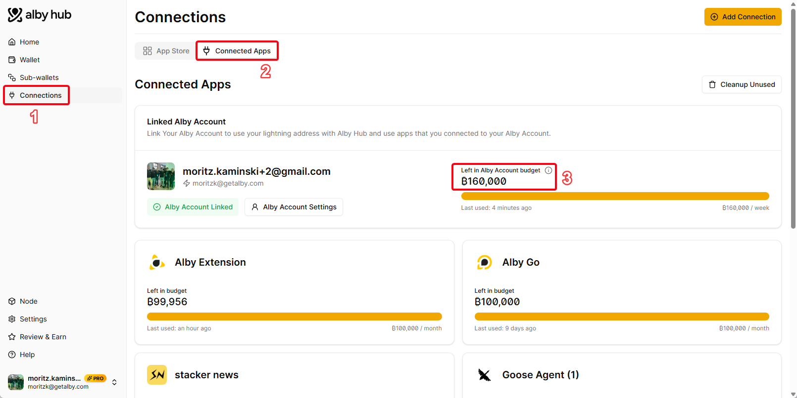

# Why is my subscription payment not successful?

There can be several reasons why the payment for your subscription is still pending. Please go through the following steps:

* [ ] **Make sure you have enough bitcoin in your spending balance.**\
  Open Alby Hub -> Wallet -> Check your balance
*   [ ] **Is your Alby Account connected?**\
    Open Alby Hub -> Connections -> Connected Apps -> Verify that your Alby Account is linked 

    <figure><figcaption></figcaption></figure>

*   [ ] **Is the allocated budget high enough to cover the next subscription payment?**\
    Open Alby Hub -> Connections -> Connected Apps -> Alby Account ->  Check that the budget is at least as high as the pending subscription payment 

    <figure><figcaption></figcaption></figure>

* [ ] **Do you have good channel partners?**\
  Check if you have a channel with one of the following peers: **Megalith LSP, LNServer, Flashsats, LQWD, Olympus, Magma**, or another well-connected peer from [this list](https://1ml.com/node?order=channelcount).\
  If not, consider opening a channel with one of them.

Thanks for checking these points. The pending subscription payment will be retried automatically.

Thank you very much for your support. 💛
