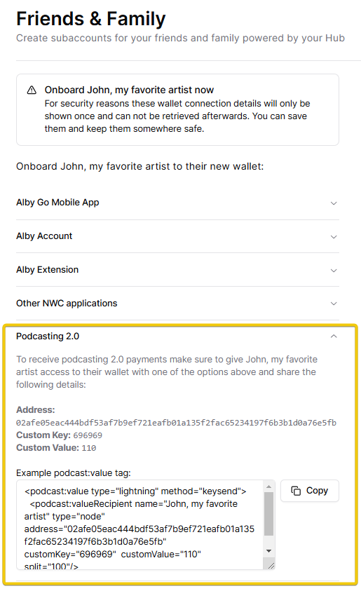

# Podcaster & musicians sub-wallets

## Make sub-wallets with their own \<podcast:value> tag

Content creators—such as podcasters, musicians, and authors—can receive payments directly from their audience, without relying on third-party platforms. Here is a guide about Value for Value payments for content creators. 👇


[👋 Creator guides](https://app.gitbook.com/o/uiUeRqI074apbV0PWsyf/s/0gUoA7kRyQexM9AWg720/)


### Step 1: Create a new Sub-wallet

First, check out this section to create a new Sub-wallet: [#create-a-new-sub-wallet](./#create-a-new-sub-wallet "mention")

### Step 2: Get the value tag for your new Sub-wallet

Right after creating the sub-wallet, you'll see several options. Open the "Podcasting 2.0" tab to access the `<podcast:value>` tag. You can share it with a friend or use it in your own podcast or music RSS feed.

<figure><figcaption></figcaption></figure>

The `podcast:value` tag needs to be added to the RSS feed of your podcast, song, blog, or other content. This lets your audience know where to send payments while they enjoy your content.

### How to enhance the sub-wallet

* **Get a Lightning Address:** The simplest way to receive bitcoin directly into this sub-wallet. [#manage-a-sub-wallet](./#manage-a-sub-wallet "mention")
* **Connect to an App (e.g., Alby Go):** Ideal if you or the sub-wallet user want to check the balance and make payments from a smartphone. [#connect-a-sub-wallet](./#connect-a-sub-wallet "mention")
* **Link an Alby Account:** Great for users who want email payment notifications, transaction exports, and additional account features.. [#link-a-sub-wallet-to-an-alby-account](./#link-a-sub-wallet-to-an-alby-account "mention")


**Congrats you just onboarded your favorite artist to bitcoin. He can now receive bitcoin payments from his audience!** 🎉


