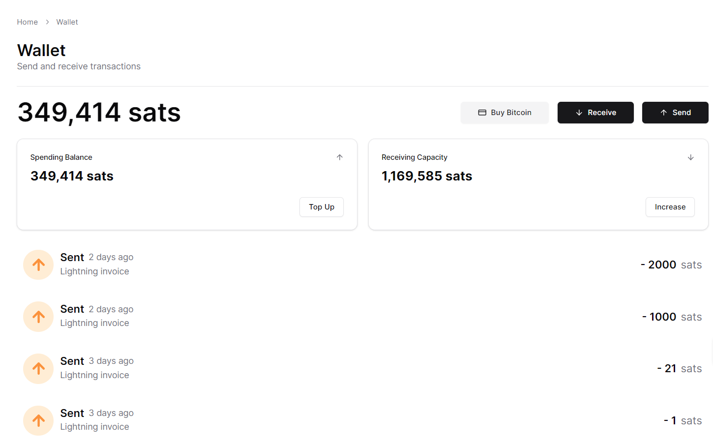

# 👛 Wallet

### Introduction

Alby Hub is available everywhere where you want pay with bitcoin: on the web, in apps or on mobile. But of course you can also send and receive bitcoin directly from the Alby Hub itself.  

<figure><figcaption>
Alby Hub wallet
</figcaption></figure>


[send.md](send.md)



[receive.md](receive.md)



[buy-bitcoin.md](buy-bitcoin.md)


***

_Alby Hub was created with a lot of effort, love, and the vision of a better world with Bitcoin. We’re grateful for your consideration in getting a_ [_membership_ ](../alby-hub-flavors/alby-cloud.md)_and supporting our work._

_Best regards, Your Alby Team 💛🐝_
