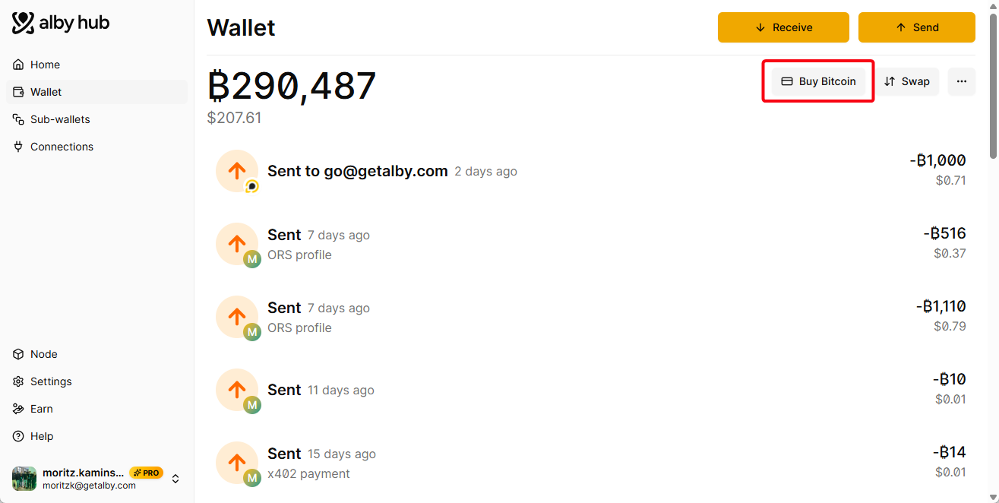
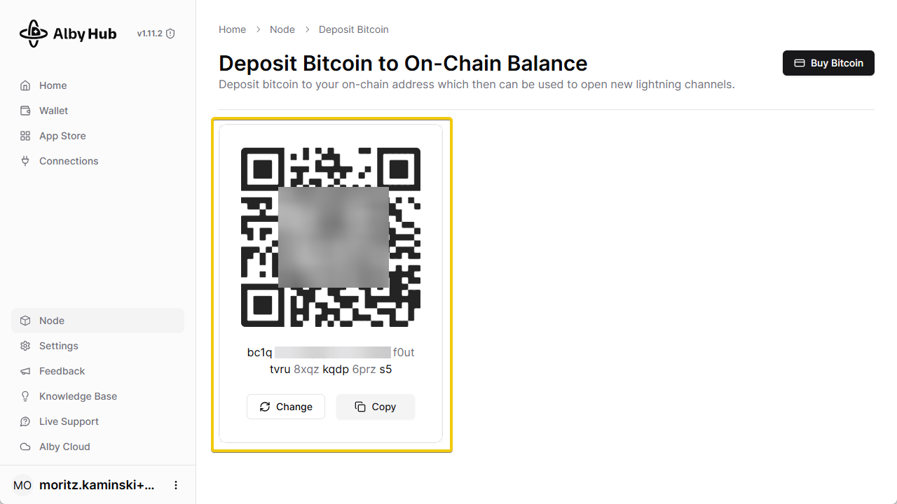

# ⬆️ Buy Bitcoin

## Buy Bitcoin to Top upyour  Wallet Balance

### Buy Bitcoin in Alby

Alby partnered with Mt.Pelerin so you can buy bitcoin directly in your Alby Account.

Open Alby Hub -> Wallet -> click on "Buy Bitcoin" -> You’ll be redirected to your Alby Account dashboard to complete the purchase.&#x20;

<figure><figcaption></figcaption></figure>

-> You’ll be redirected to your **Alby Account dashboard** (getalby.com/topup) -> Choose "**Credit card or bank transfer**" to complete the purchase in a widget from Mt.Pelerin.&#x20;

<figure><figcaption></figcaption></figure>

Alternatively, you can use stablecoins and other cryptocurrencies to top up your Alby Hub as indicated in the screenshot above. Visit: [getalby.com/topup](https://getalby.com/topup)&#x20;

### Buy Bitcoin at an exchange

If you have Bitcoin in an exchange wallet, here are links to well-known exchanges with instructions on how to withdraw bitcoin via ⚡lightning:&#x20;

| Global                                                                                                                                                             | EU+UK                                                     | US/Canada                                                                                                | Latinamerica                                                                                                               |
| ------------------------------------------------------------------------------------------------------------------------------------------------------------------ | --------------------------------------------------------- | -------------------------------------------------------------------------------------------------------- | -------------------------------------------------------------------------------------------------------------------------- |
| [Coinbase](https://help.coinbase.com/en/coinbase/trading-and-funding/sending-or-receiving-cryptocurrency/lightning)                                                | [Pocket](https://pocketbitcoin.com/lightning)             | [CashApp (only US)](https://cash.app/help/6506-lightning)                                                | [Bipa (only Brasil)](https://suporte.bipa.app/hc/pt-br/articles/4415356329371-Como-transferir-Bitcoin-pela-rede-Lightning) |
| [Kraken](https://support.kraken.com/hc/en-us/articles/5068216131988-How-do-I-send-bitcoin-on-the-Lightning-Network-)                                               | [Mt. Pelerin](https://www.mtpelerin.com/lightning-wallet) | [Bitcoin Well](https://bitcoinwell.com/blog/how-to-buy-bitcoin-on-the-lightning-network-with-e-transfer) | [Lemon](https://help.lemon.me/en/articles/6431910-que-es-y-como-envio-o-recibo-por-lightning-network-ln)                   |
| [Binance](https://www.binance.com/en/support/faq/how-to-use-the-bitcoin-lightning-network-to-deposit-and-withdraw-btc-on-binance-7a4eb2d9ccaf4433908b448aa3a93493) |                                                           |                                                                                                          | [Belo](https://help.belo.app/en/articles/5899323-how-to-withdraw-btc-from-belo-via-the-lightning-network)                  |
| [Strike](https://strike.me/faq/how-do-i-send-bitcoin/)                                                                                                             |                                                           |                                                                                                          |                                                                                                                            |
| [OKX](https://www.okx.com/help/how-do-i-withdraw-bitcoin-btc-with-okx-lightning-network)                                                                           |                                                           |                                                                                                          |                                                                                                                            |

***

## 2. Buy Bitcoin to top up your On-chain Balance

### Buy Bitcoin in Alby

You can buy bitcoin for the on-chain wallet directly via your Alby Hub.\
Open Alby Hub -> Go to _Node_ -> _Advanced_ -> Click "_Buy_" -> Define the amount&#x20;

<figure><figcaption></figcaption></figure>

-> You’ll be redirected to your **Alby Account dashboard** (getalby.com/topup) -> Choose your preferred option to complete the purchase. For on-chain buys we partnered with MoonPay (Credit Card or Paypal) and Mt.Pelerin (Credit card or bank transfer).&#x20;

<figure><figcaption></figcaption></figure>

Alternatively, you can use stablecoins and other cryptocurrencies to top up your Alby Hub as indicated in the screenshot above. Visit: [getalby.com/topup](https://getalby.com/topup)

### Buy Bitcoin at an exchange&#x20;

You can send bitcoin from any on-chain wallet or exchange platform to your Alby Hub

Go to _Node_ -> _Advanced_ -> _Deposit_ -> Copy the bitcoin address (bc1q....s5)

<figure><figcaption>
Deposit bitcoin to your on-chain wallet in Alby Hub
</figcaption></figure>

&#x20;**After one block confirmation (\~10 min.) the deposited funds appear in your On-Chain Balance.**  ✨

***


**Congrats!** **You successfully topped up your wallet.** 💪

