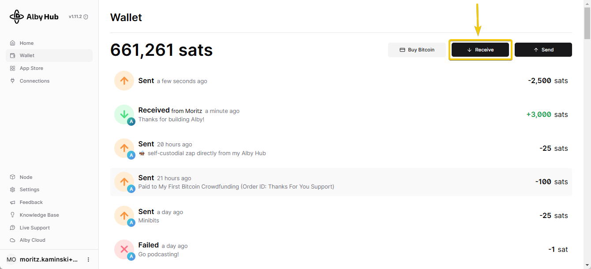
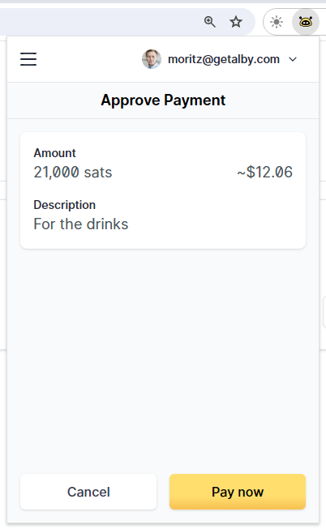
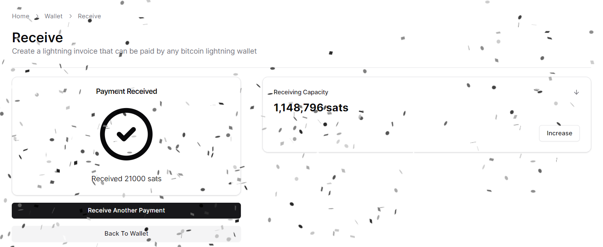

# 📥 Receive

Use bitcoin, stablecoins, or other cryptocurrencies to top up your balance in Alby Hub. Stablecoins and other cryptocurrencies are automatically swapped to bitcoin before being credited to your Hub.

### 1. Navigate to "Wallet" and click on "Receive"

<figure><figcaption>
Alby Hub wallet
</figcaption></figure>

### **2. Select your option to receive**

**You have the following options to receive:**

* Share the QR code
* Share your lightning address (i.e. moritzk@getalby.com)
* Create and share a lightning invoice
* Create and share a lightning offer following the BOLT12 spec.
* Receive from On-chain
* Create and share a lightning invoice -> paste it into the [FixedFloat website](https://ff.io/?ref=qnnjvywb) -> swap any stablecoin or cryptocurrency into your Alby Hub.&#x20;

<figure><figcaption></figcaption></figure>

### Example: Create a lightning invoice

#### &#x20;Enter the amount you want to receive and optionally a description...

<figure><figcaption></figcaption></figure>

#### ...and copy the invoice to pass it on to the sender&#x20;

<figure><figcaption></figcaption></figure>

This is how it looks when the sender pays the invoice with the Alby Extension

<figure><figcaption>
Payment with Alby Extension
</figcaption></figure>

### Congrats. You successfully received the payment. 🎉&#x20;

<figure><figcaption>
Payment received in Alby Hub
</figcaption></figure>

Don't worry if the sender does not pay immediately. Alby Hub is always online if it runs in the cloud and can receive payments 24/7. In your Alby dashboard on getalby.com you can configure payment notifications to ensure you don't miss any incoming payments. 🙂
