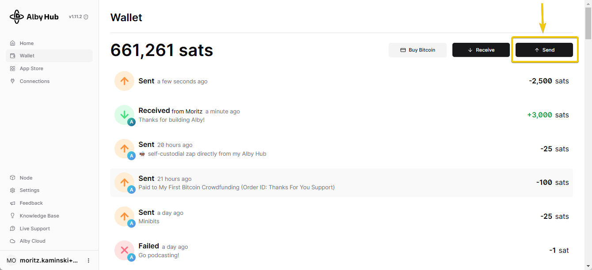

# 📤 Send

### 1. Navigate to "Wallet" and click on "Send"

<figure><figcaption>
Alby Hub wallet
</figcaption></figure>

### 2. Enter a lightning invoice of the recipient and click "Continue"

<figure><figcaption></figcaption></figure>

### 3. Final step: Add Amount and Click "Send"

A comment is optional.

<figure><figcaption></figcaption></figure>

### **Congrats. You successfully sent a payment!** 🎉

<figure><figcaption></figcaption></figure>


The string of characters called _**preimage**_ serves as your digitally verifiable payment confirmation. \
Once the payment reaches the intended recipient, the recipient’s wallet application reveals the preimage to the sender and the sender’s wallet (e.g. your Alby Hub) can consider the payment to be complete.

