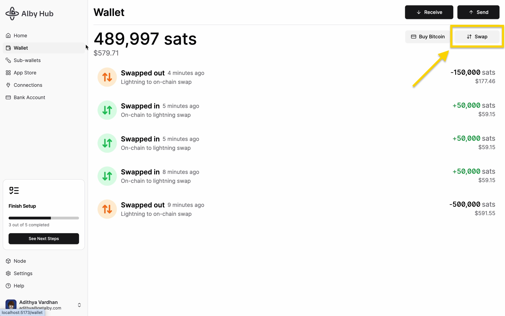
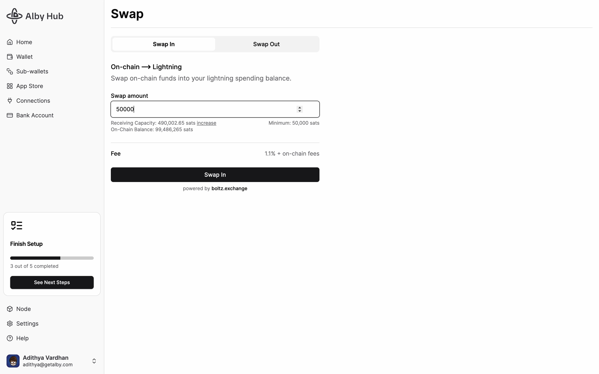
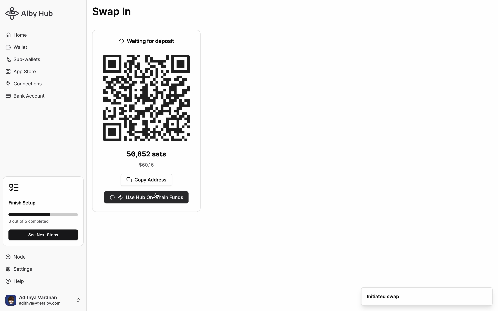
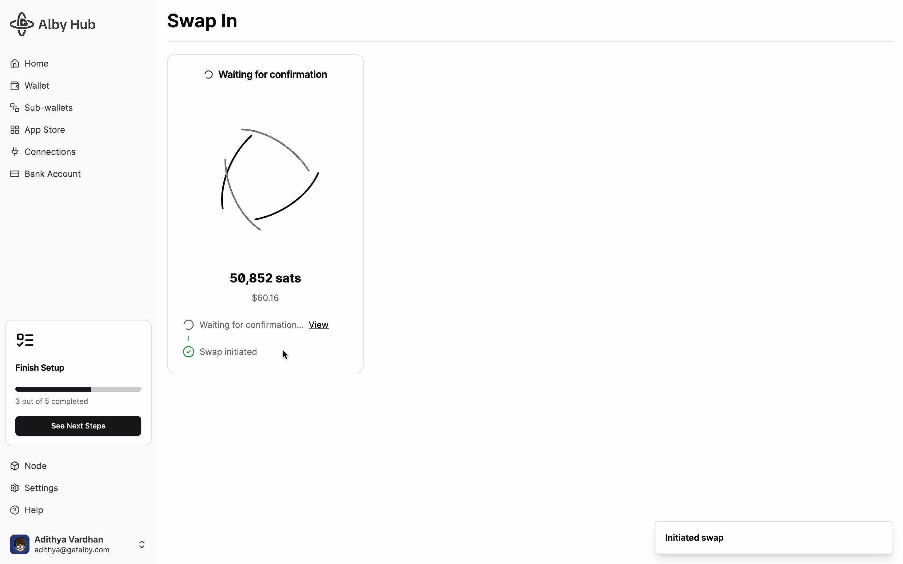
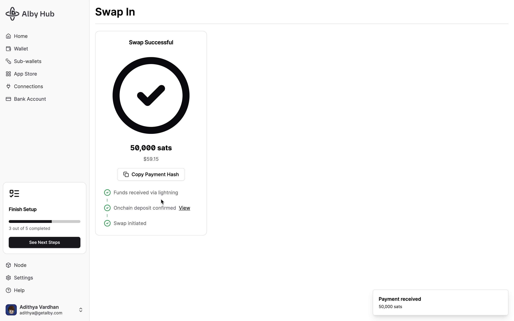
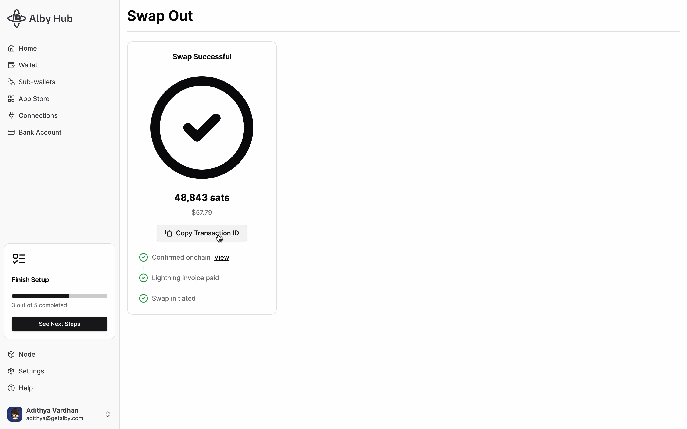

# 🔁 Swaps

You can transfer bitcoin between your Alby Hub on-chain balance and your Alby Hub spending balance through a swap, using its existing channels and receiving capacity. ⚡🔄

## Overview:

1. [Swap In](swaps.md#swap-in): Transfer funds from your on-chain balance to your spending balance.
2. [Swap Out:](swaps.md#swap-out) Transfer funds from your spending balance to your on-chain balance.
3. [Set up Auto Swaps](swaps.md#set-up-auto-swaps)

## Swap In

Transfer funds from your on-chain balance to your spending balance.

### 1. Navigate to "Wallet" and click on "Swap"

<figure><figcaption></figcaption></figure>

### 2. Enter a Swap Amount and click "Swap In"

<figure><figcaption></figcaption></figure>

### 3. Scan the QR using an external bitcoin wallet or use your Alby Hub funds


If you're sending from an external wallet make sure you send the **exact** amount specified, failing to do so will result in a swap failure followed by an immediate refund.


<figure><figcaption></figcaption></figure>

### 4. Wait for 1 on-chain confirmation

The swap is now initiated, and you'll see a **"Waiting for confirmation"** loading screen ⏳\
Swap In needs **1 on‑chain confirmation** (\~10 minutes); once that's done, you'll receive an incoming payment notification! 🎉

<figure><figcaption></figcaption></figure>

### 5. Congrats. You successfully made a Swap In 🎉&#x20;

<figure><figcaption></figcaption></figure>


If a **Swap In** fails or doesn't arrive in time, don't worry, your bitcoin are safe. Go to **Debug Tools > List Swaps**, note the Failed Swap ID, and then **Debug Tools > Refund Swap**, enter the ID, and click **Done**.


***

## Swap Out

Transfer funds from your spending balance to your on-chain balance.

### 1. Navigate to "Wallet" and click on "Swap"

<figure><figcaption></figcaption></figure>

### 2. Enter a Swap Amount and click "Swap Out"

You can also select an external on-chain wallet. However, please double check the wallet address before proceeding to avoid loss of funds.

<figure><figcaption></figcaption></figure>

### 3. Wait for deposit and 2 on-chain confirmations

The swap is now initiated, and you'll see a **"Paying lightning invoice"** loading screen ⏳\
In just a few seconds, the state should change to **"Waiting for 2 on-chain confirmations".**

This is because Swap Out is a two step process. First our swap provider locks up the funds, and as soon as the lightning invoice is paid, we broadcast another transaction to claim it. Once that's done, you should be receiving bitcoin to your on-chain wallet! 🎉

Swap Out screen step 1: Waiting for deposit

<figure><figcaption></figcaption></figure>

Swap Out screen step 2a: Waiting for 2 on-chain confirmations

<figure><figcaption></figcaption></figure>

Swap Out screen step 2b: Waiting for another on-chain confirmation

<figure><figcaption></figcaption></figure>

### 4. Congrats. You successfully made a Swap Out 🎉&#x20;

<figure><figcaption></figcaption></figure>

***


If a **Swap Out** fails or doesn't arrive in time, your lightning invoice payment will be canceled and your bitcoin will be returned automatically, no manual refund needed.


## Set up Auto-Swaps

If manual swap-outs proof useful to you, you can automate them to **maintain receiving capacity without manual intervention.**


[auto-swaps.md](../node/auto-swaps.md)



For swap in and swap out, there will be a short waiting period while the transaction confirms on-chain ⏳. This usually takes a few minutes, depending on block confirmations. Sit tight, and your bitcoin will arrive soon! 😊


#### Also Checkout:


[what-happens-if-i-lose-access-to-my-hub-while-a-swap-is-in-progress.md](../faq/what-happens-if-i-lose-access-to-my-hub-while-a-swap-is-in-progress.md)

