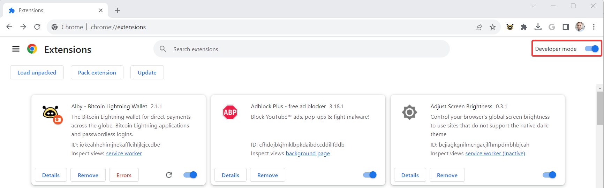
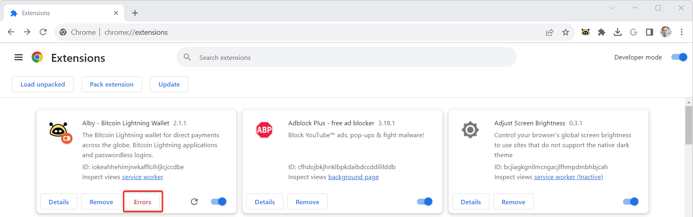
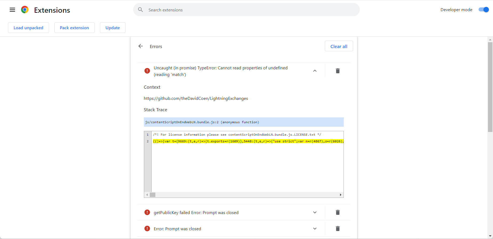
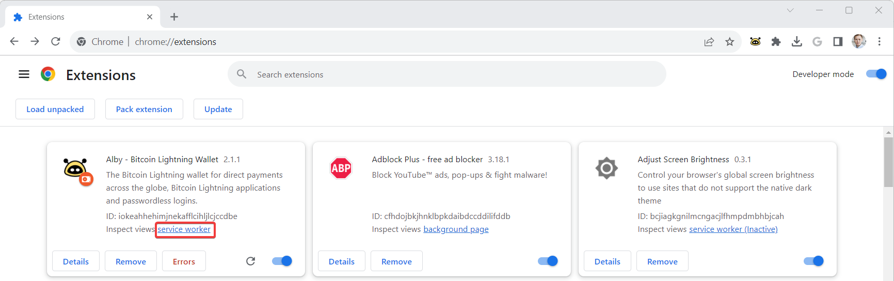

# Google Chrome

This section guides you to find the relevant data that helps us to debug the Alby browser extension.

#### 1. Step: **Open 'chrome://extensions' in your Chrome Browser**

**2. Step: Switch on developer mode (top right)**

<figure><figcaption></figcaption></figure>

#### **3. Step: Locate the Alby browser extension and click on 'Errors'**&#x20;

<figure><figcaption></figcaption></figure>

#### **Unfold the error messages and make a screenshot**

<figure><figcaption></figcaption></figure>

#### **4. Step: Locate the Alby browser extension and click on 'service worker'**

<figure><figcaption></figcaption></figure>

#### **5. Step:** Navigate to 'Console'. Are there any error messages in red? If yes, make a screenshot.

#### 6. Step: Navigate to 'Network'. Are there any error messages in red? If yes, make a screenshot.

#### 7. Step: **Please describe the issue and send your screenshots to** us via the chat widget on support.getalby.com

To speed up replies to your request, please use this form:&#x20;

> **Subject:**&#x20;
>
> **Describe the bug:** \[A clear and concise description of what the bug is.]
>
> **Steps to reproduce the behavior:**
>
> 1. Visit '...'
> 2. Click on '....'
> 3. Scroll down to '....'
> 4. See error
>
> **Expected behavior:** \[A clear and concise description of what you expected to happen.]
>
> **Information about Alby**
>
> * Alby Version: \[e.g. 1.5.0]
> * Alby installed through \[e.g. the browser stores, installed manually]
> * Wallet connected with Alby \[e.g. LND, BlueWallet LNDhub]
>
> **Screenshots (if any)** Add screenshots to help explain your problem.
>
> **Device information \[optional]:**
>
> * OS: \[e.g. Windows]
> * Browser \[e.g. Chrome, Firefox]
> * Browser Version \[e.g. 22]
>
> **Additional context:** \[Add any other additional context about the problem here.]

**Thank you for your collaboration** 🙏.
