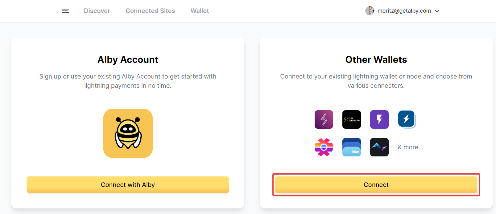
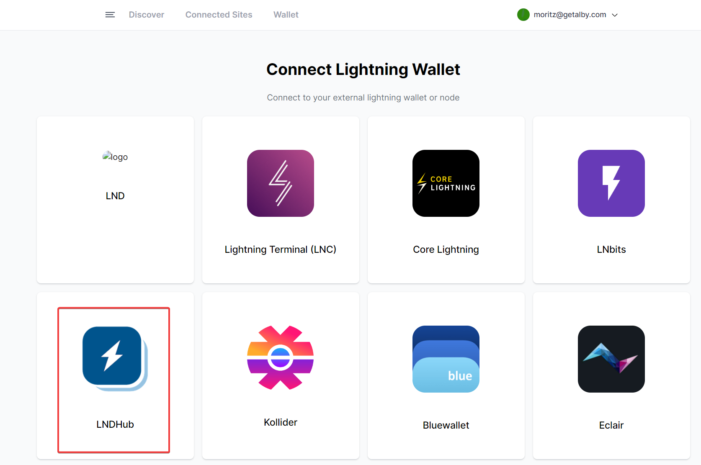
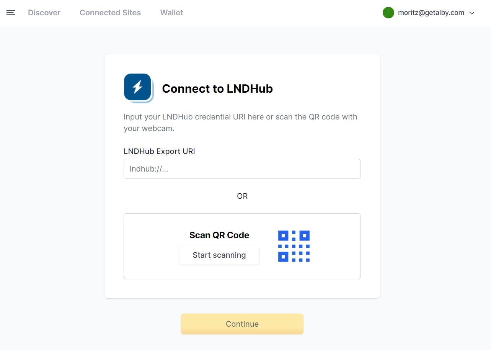

# How to access my old account in apps with the Alby Extension

The Alby Browser Extension introduced a new way to connect the Alby Account. This greatly improves personalization of the Alby Extension for users of the Alby Account. But it also interferes with the login on other websites. To get access to your original account on other websites, please follow these steps:

**Step 1: Go to** [**https://getalby.com/node**](https://getalby.com/node) **and copy your 'Wallet Connection Credentials'**

<figure><figcaption></figcaption></figure>

**Step 2: In the Alby Browser Extension, click on " + Add " at the end of the extension menu.**

**Step 3: Select 'Connect'**

<figure><figcaption></figcaption></figure>

**Step 4: Select 'Connect'**

<figure><figcaption></figcaption></figure>

**Step 5: Add your Alby Account credentials from Step 1**

<figure><figcaption></figcaption></figure>

**Step 5: Select the Account in the Alby extension via the account selector (top right)**

The account is called LNDHub when you just added it&#x20;

<figure><figcaption></figcaption></figure>

**You can now log into your previous account on other websites**&#x20;

#### &#x20;
