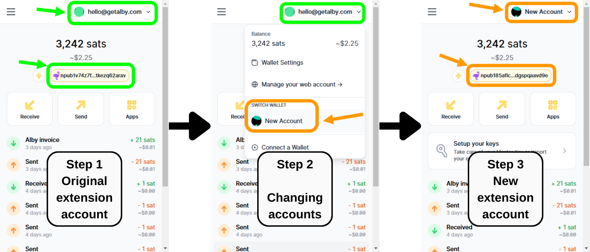
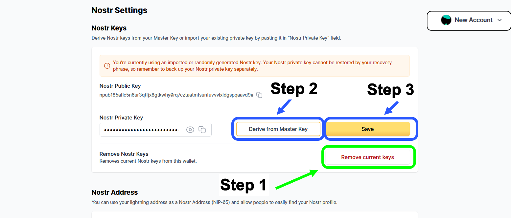

# I lost my Nostr ID when making a new account

After making a new account, installing the plugin in a new browser, or when uninstalling the plugin and re installing it a common problem happens: the Nostr keys of the new account are different than the previous original account.

***

### These are the steps taken to encounter this problem

(Don't do these steps or you'll have this problem...)

This screenshot is for you to understand what happened and why you experienced this apparent loss of your Nostr keys.

<figure><figcaption>
Changing from Original account to New Account
</figcaption></figure>

Even if both the Original account and the New account are associated with the same "Alby web account" or the same self-hosted node, the Nostr Nsec keys are never stored in Alby's servers and have nothing to do with our Alby web account. The Nostr Nsec keys are always stored inside your Alby extension in your browser. When making a new account on the extension, you will have a new Master key automatically provieded, and an automatically Nostr key derived from that master key into this New Account. To recover the old ones we have to place the old Master key or Nsec key manually.

***

## Recovering the Nostr keys from the Original account and placing those into the New account.

* _**CASE 1.**_ If your Nostr keys were derived from your Master Key please recover your Master Key first, then derive your Nostr key from your Master key
* _**CASE 2.**_ If your Nostr keys were not obtained from a Master Key, please follow the steps in this page to recover your backedup Nostr Nsec keys

***

## Case 1. Your Nostr keys were originated from the Master Key of your Original Account

...And you need to import them into your New Account

#### Step 1. Log into your Original Account. Copy the Master keys of your original account

<figure><figcaption>
Under Wallet Settings of your Alby extension account
</figcaption></figure>

#### Step 2. Log into the New account. Erase its current Master Keys

<figure><figcaption>
Erasing Master Keys from New Account
</figcaption></figure>

#### Step 3.  Import the Master keys from the Original Account into the New Account

<figure><figcaption></figcaption></figure>

#### Step 4. Erase previous Nostr Keys, then "Derive Nostr Keys from current Master Key"

<figure><figcaption></figcaption></figure>

### Congratulations!

You have now recovered the old Nostr keys of your original account and place them into the New account! You will be able to continue using your original Nostr user.

***

## Case 2. Your Nostr keys were backed up, and you need to re import them

In this case, your Nostr keys are not derived from a Master Key. You obtained your Nsec Nostr keys in some other way or from a legacy Alby extension (before Master Keys were introduced). You simply need to re-import your backed-up Nostr Nsec keys into your new account.

You must have a backup of the original Nostr Nsec keys or access to the original account to copy the original Nostr Nsec keys.

#### Step 1. (If you do not have the backup of your Nostr Nsec Keys). Log into your Original Account to copy them.

<figure><figcaption>
Getting the Nostr Nsec Key from the Original Account
</figcaption></figure>

#### Step 2.  Go to Nostr Setting, "Remove current keys", and then paste the Original Nostr Nsec keys  and click on "Save".

<figure><figcaption>
Pasting the backed up Nostr Nsec Keys into the New Account
</figcaption></figure>

### Congratulations

You have now recovered the old Nostr keys of your original account and place them into the New account! You will be able to continue using your original Nostr user.

