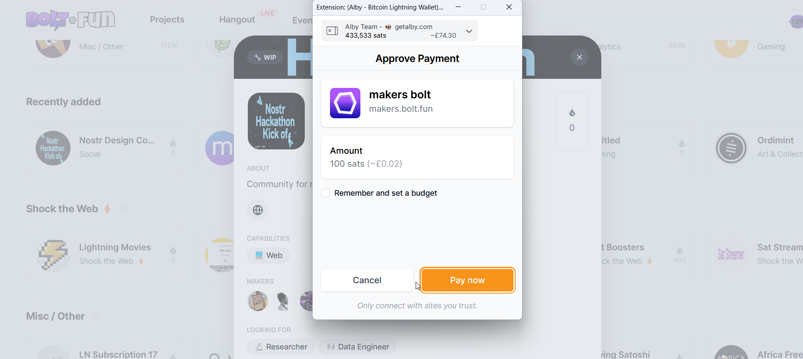
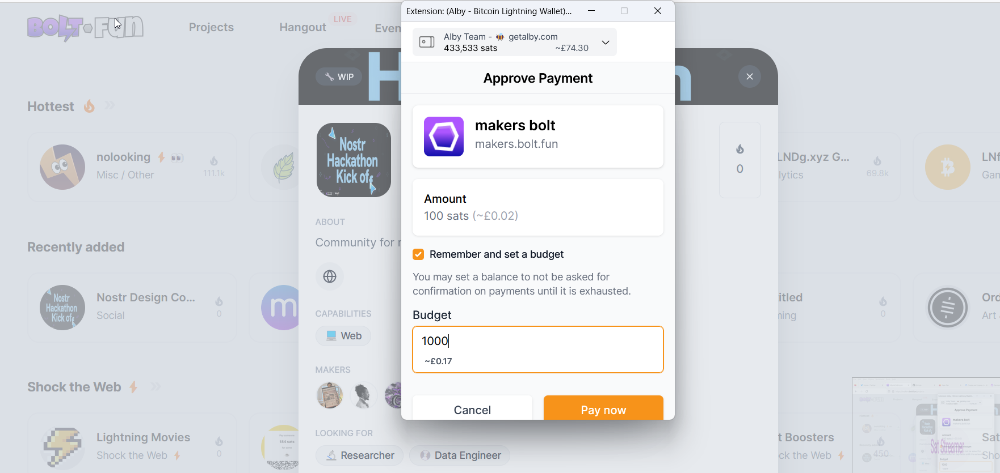
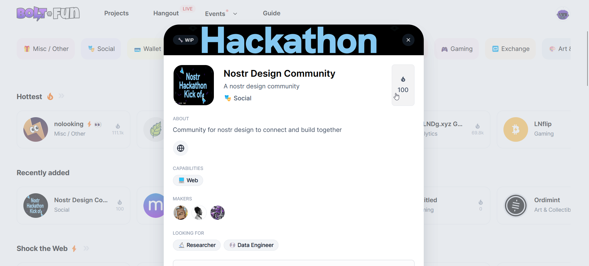
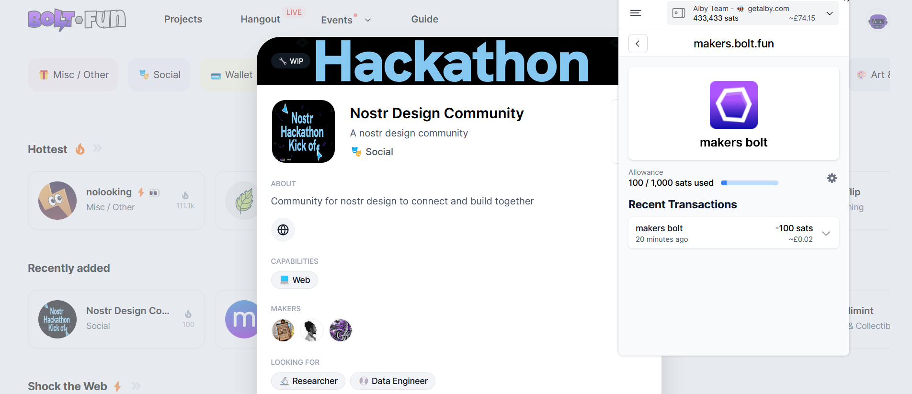
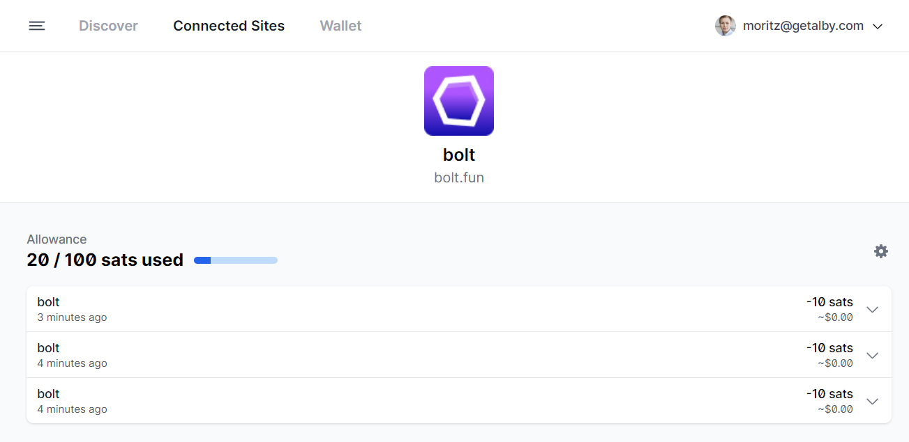
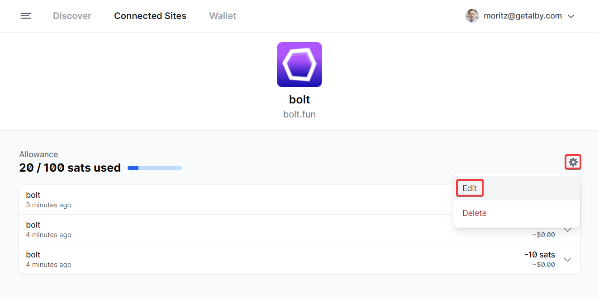

# 💵 Create and change budgets

When you want to pay, Alby asks to confirm the payment

<figure><figcaption></figcaption></figure>

To avoid these requests you can create an allowance by checking the box in the prompt window. You will then have the chance to choose the budget for this website. When you click on confirm you pay the displayed amount and activate the allowance.

<figure><figcaption></figcaption></figure>

Now we can pay again with one click without an additional confirmation as long as we are within the set budget.

<figure><figcaption></figcaption></figure>

To check your active allowances you can open the extension window and see how much of it you have already spent..

<figure><figcaption></figcaption></figure>

..or you can go to '**Connected Sites**' in the Settings extension window.

<figure><figcaption></figcaption></figure>

Here, you see all websites that we granted access to your wallets. You will also see all active allowances and what budget is left per website.

<figure><figcaption></figcaption></figure>

By clicking on one of the websites you will see the site-specific transaction history

<figure><figcaption></figcaption></figure>

By clicking on the gearwheel you can now set a new budget. The new budget overwrites the old one and starts at 0 sat used.

<figure><figcaption></figcaption></figure>

<figure><figcaption></figcaption></figure>
