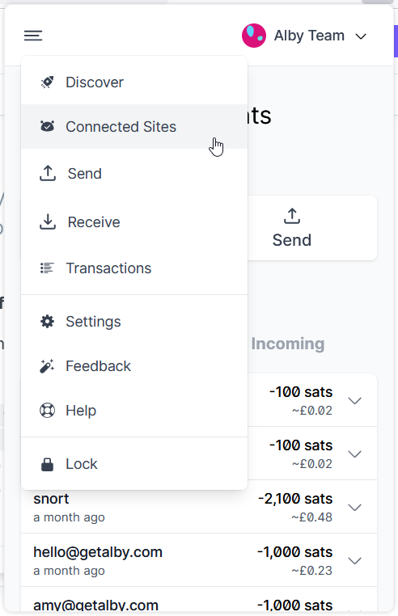
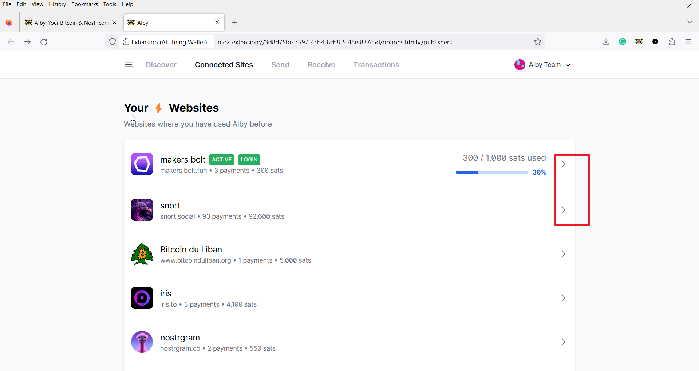
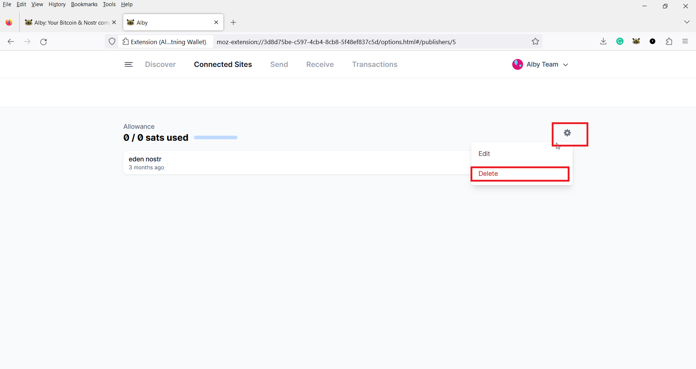

# 🥍 Manage connected websites

## Manage permissions on sites



***

## Delete a connected website

#### Step 1: Open Alby and **select 'Connected sites' from the drop-down menu**

To navigate to the place where you can delete an active website, open the extension and select “Connected sites” from the drop-down menu in the top left corner.

<figure><figcaption></figcaption></figure>

#### Step 2: Select the website you to delete **by clicking on '>'**

<figure><figcaption></figcaption></figure>

#### **Step 3: Click on '**⚙' **and delete website from the list**

By clicking on the gearwheel you can revoke access to that specific website by deleting it from the list.

<figure><figcaption></figcaption></figure>
