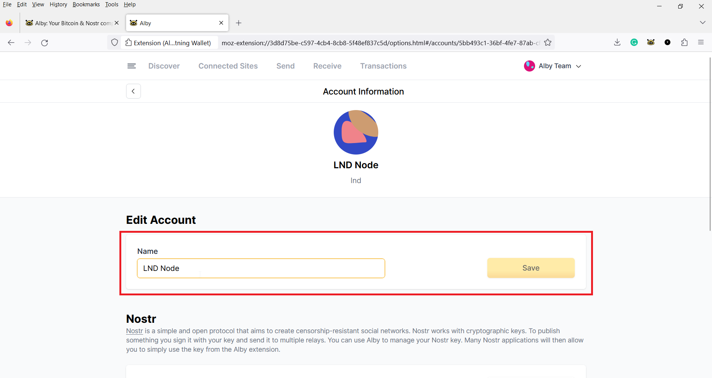
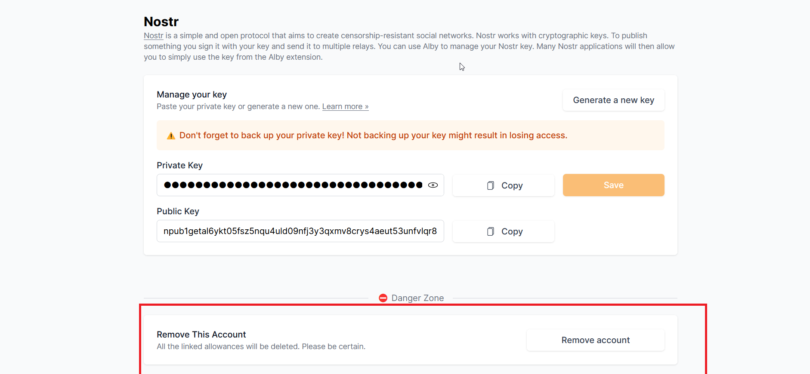

# 💳 Manage multiple wallets

#### **Step 1: Open the extension in your browser, open the drop down menu by clicking on the '**˅' **button in the top right corner.**

<figure><figcaption></figcaption></figure>

In the extension menu, you'll see your wallet. The Alby Browser extension lets you connect multiple wallets. By default, you'll likely connect your Alby web account, but you can also link other wallets via NWC (Nostr Wallet Connect). The wallet name will match the connector type by default (e.g., NWC Connection).

<figure><figcaption>
We have three wallets here.
</figcaption></figure>

#### Step 2: Click on 'Wallet Settings'

To customize and re name these wallets we must go to the extension “Settings”.

<figure><figcaption></figcaption></figure>

#### Step 3: Edit the name section to what you wish to name the wallet and hit save.

<figure><figcaption></figcaption></figure>

#### Step 4: scroll to the bottom of the selected wallet page to 'disconnect wallet' if you wish to unlink it

<figure><figcaption></figcaption></figure>

####  

&#x20;
