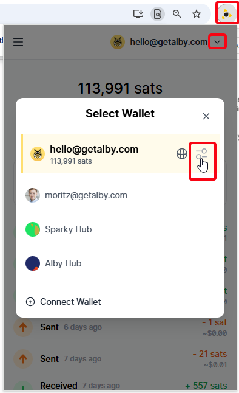
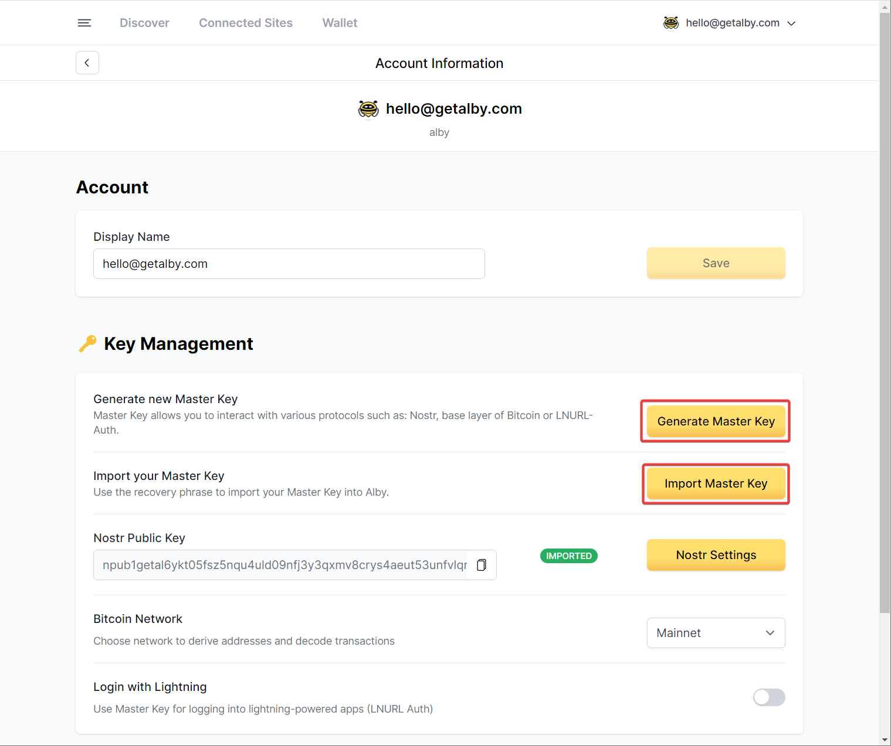
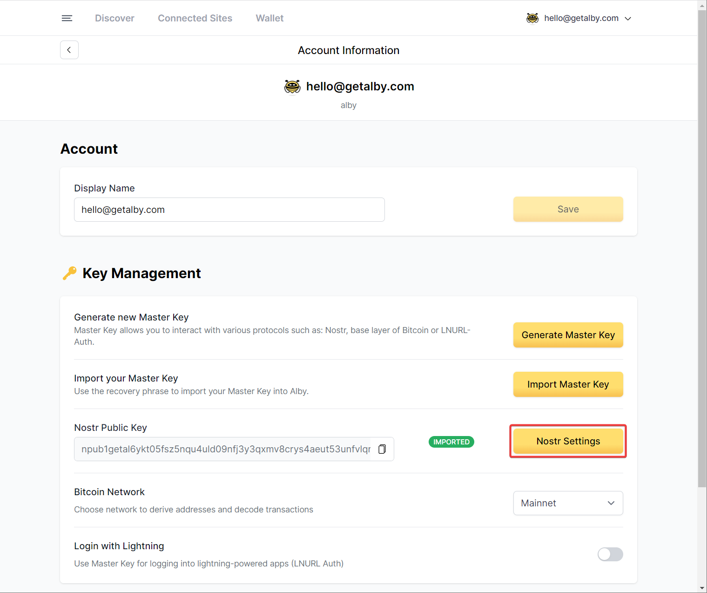
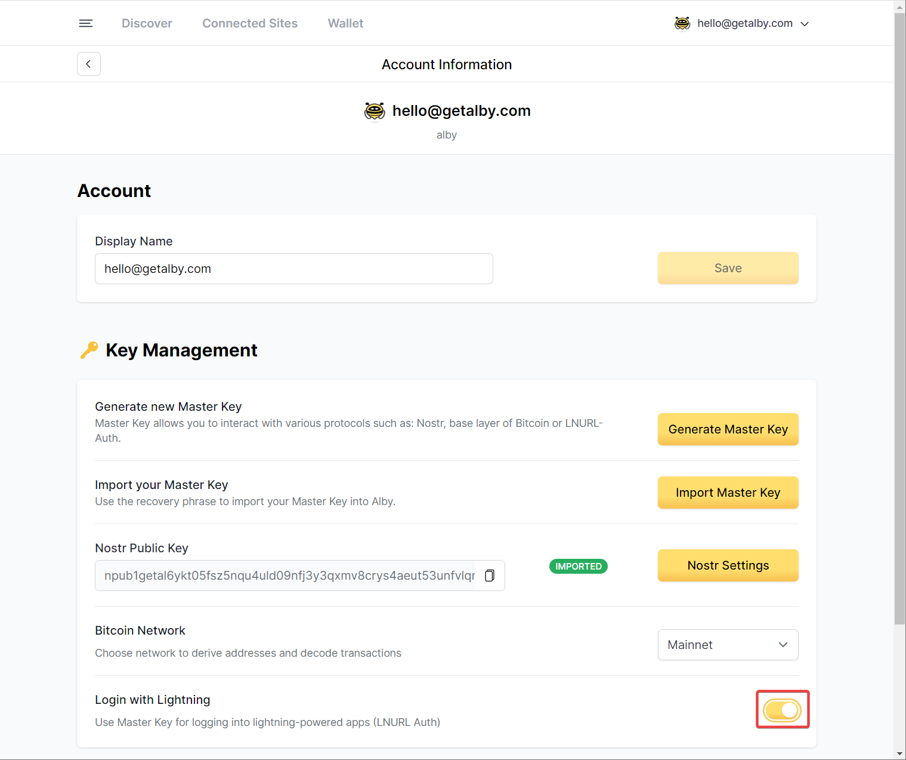
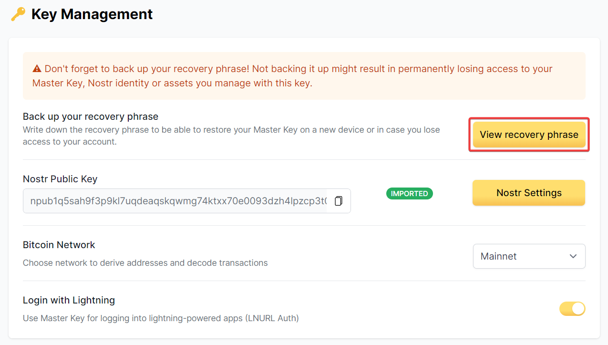

# 🗝️ Master Key

The Master Key allows you to interact with various protocols such as: Nostr, Bitcoin on-chain, Liquid or LNURL-Auth.

### How to generate a new Master Key and how to import an existing Master key


You can generate one Master Key for each wallet in the Alby Browser Extension


#### **Step 1**: **Open the Alby Browser Extension, select the relevant account and click on the settings symbol**

<figure><figcaption></figcaption></figure>

#### **Step 2: Here you can generate a new Master Key or import your existing one**

<figure><figcaption></figcaption></figure>

#### **Step 2a: To Create or add a Nostr private key, click on Nostr Settings**

<figure><figcaption></figcaption></figure>

For more information about how to create, import and manage your Nostr keys visit:



#### **Step 2b: To use the Master Key for logging into lightning-powered app via LNURL Auth), switch the toggle**

<figure><figcaption></figcaption></figure>


**Don't forget to backup your Master Key. It cannot be recovered in case it's lost. You will find the 12 words recovery phrase of your Master Key by following step 2.**


<figure><figcaption></figcaption></figure>

### How to access the recovery phrase of your Master Key

Perform step 1 from above: Open the Alby Browser Extension, select the relevant account and click on 'Account settings'. You will find a button to view your recovery phrase.

<figure><figcaption></figcaption></figure>
