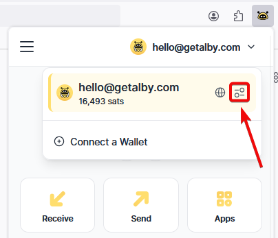

# 🦤 Nostr

## Getting started

With Alby you securely manage your Nostr account keys and safely use Nostr web clients. Your private keys only live in Alby and will never be shared. &#x20;

Every account in Alby can have an individual Nostr key. This allows you to manage multiple Nostr keys.


It is important to know that your Nostr keys are stored only locally on your computer.&#x20;


## View and edit your Nostr keys

#### **Step 1**: **Open the Alby Browser Extension, select the relevant wallet and click on 'Wallet settings'**

<figure><figcaption></figcaption></figure>

#### **Step 2: Here you can view and edit your Nostr Key if you click on 'Nostr Settings'**

<figure><figcaption></figcaption></figure>

## 🔑 Importing or Generating your keys

You can either import an existing key or generate a new private Nostr key. The newly generated Nostr key is derived from your Master Key in the Alby Browser Extension.

#### **Step 1: Navigate to the relevant wallet in the Browser Extension and click on 'Nostr Settings'**

<figure><figcaption></figcaption></figure>

#### **Step 2: Navigate to the relevant wallet in the Browser Extension and click on 'Nostr Settings'**

<figure><figcaption></figcaption></figure>

Now you can import an existing Nostr private key by pasting it in the relevant field or generate a new key by creating a Master Key. If you already created a Master Key before, the fields are automatically filled with your new keys.

&#x20;                                              .png>)

**Congrats! You successfully created your Nostr keys.**&#x20;


If you already store a Nostr key in one account, it won't be overwritten by a new Master Key.

Make sure to always have a backup of your key!


**What's next?** Try out some of these Nostr apps and enjoy seamless browsing with your very own identity across different apps: [https://www.nostrapps.com/](https://www.nostrapps.com/)&#x20;

## 🪄 Getting a Nostr NIP05 identifier

With an getAlby.com account and lightning address (e.g. you@getalby.com) you can also configure your NIP05 Nostr identifier. NIP-05 is a verification method for your Nostr account across all clients and friends can then find you with that address instead of the public key. Here is how:


[Nostr Identifier](https://app.gitbook.com/s/WKqqWqKEAO8XHGTjzhEl/features/nostr-identifier)


## 📖 Further resources

* [nostr-resources.com](https://nostr-resources.com/)
* [nostr.how](https://nostr.how/)
* [nostr.directory](https://www.nostr.directory/)

## Nostr web clients

There are various different Nostr clients out there and with your Nostr identity managed in the Alby extension you can easily use all of them. No signup or similar needed. For example try these:

* [Coracle](https://coracle.social/notes)
* [Jumble](https://jumble.social/)
* [Primal](https://primal.net/home)

