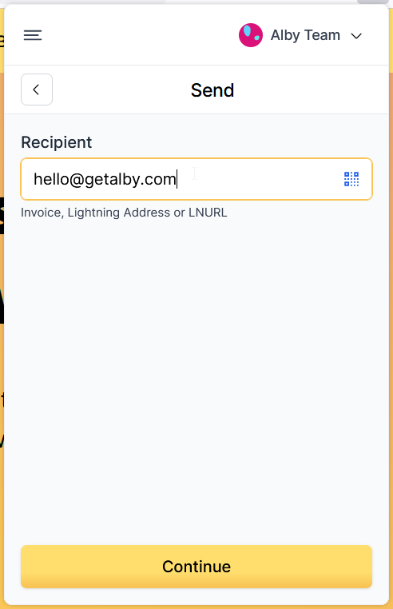
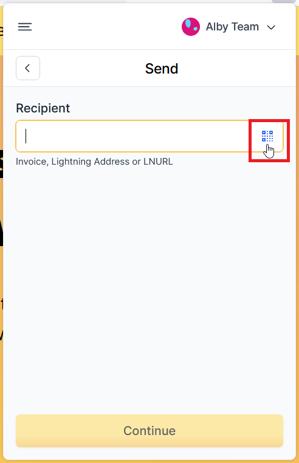
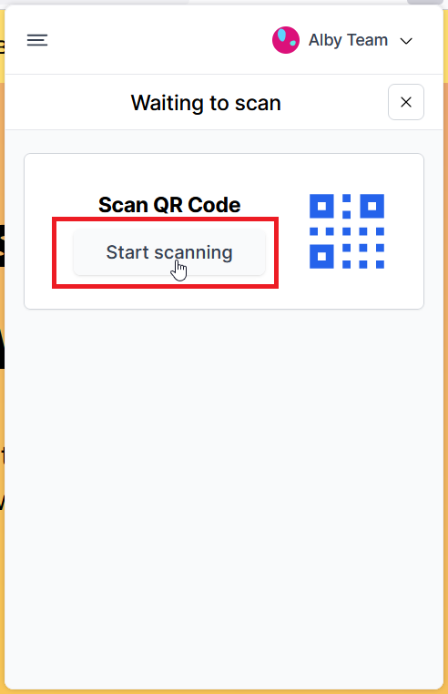
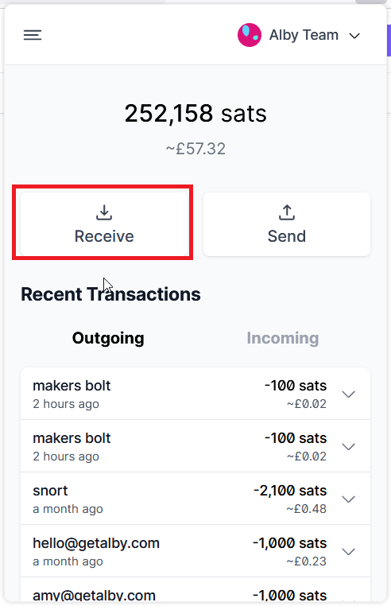
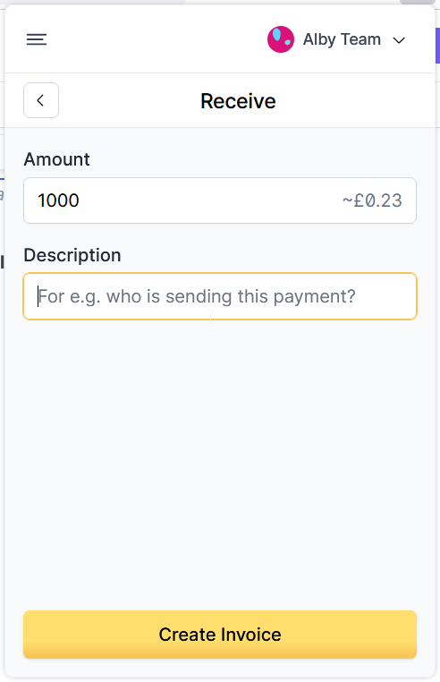
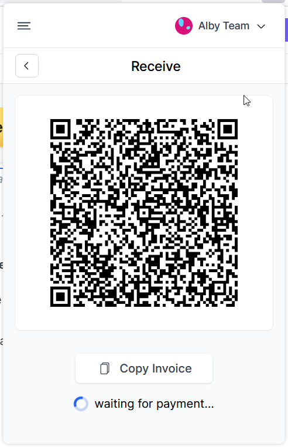

# 🔂 Send and receive bitcoin

This page shows you how to send and receive bitcoin with the [Alby Browser Extension](https://getalby.com/alby-extension). For mobile payments, try [Alby Go](https://getalby.com/alby-go).

## Send bitcoin

#### Step 1: Open Alby and click on 'Send'

<figure><figcaption></figcaption></figure>

#### Step 2a: Insert the destination of your payment into the 'Lightning Invoice' field

<figure><figcaption></figcaption></figure>

* You can paste an invoice, LNURL or a Lightning Address into the field.
* Click on "Continue" to proceed

#### Or step 2b: Scan a QR code or paste a lightning invoice to add the destination of your payment

To scan a QR code, click on the QR code icon first

<figure><figcaption></figcaption></figure>

Start Scanning

<figure><figcaption></figcaption></figure>

Make sure you have granted permission to your camera.

Alternatively, you can also copy and paste a lightning invoice in the field above.

#### **Step 3: Fill in payment details**

* Amount in satoshi or press one of the shortcut buttons
* Add an optional comment (That is a great way to say thank you or include another message to the payment)

Click on 'More' and you have the option to add your name and email. (This is optional)

<figure><figcaption></figcaption></figure>

#### **Step 4: Scroll down and click on 'Confirm'**

<figure><figcaption></figcaption></figure>

## Receive bitcoin

#### Step 1: Open Alby and click on 'Receive'

<figure><figcaption></figcaption></figure>

#### Step 2: Enter payment details and click 'Create Invoice'&#x20;

<figure><figcaption></figcaption></figure>

* The "Description" field is optional but helpful to assign a payment to a sender

#### Step 3: Copy invoice and share it with the sender

* once the invoice is paid and you received the amount you will see a confetti animation in the window of the extension
* but you do not have to wait until then; your balance will show the updated amount.

<figure><figcaption></figcaption></figure>
