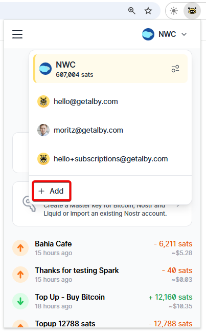

# 🔗 Link wallet

To connect bitcoin lightning wallets and nodes to the [Alby Browser Extension](https://getalby.com/alby-extension), follow these steps. For a self-custodial wallet that works great with the extension, try [Alby Hub](https://getalby.com/alby-hub). 

**Step 1:** Click on the account selector and on '**+ Add**'

<figure><figcaption></figcaption></figure>

**Step 2:** Click "Connect with Alby" or "Connect" other wallets

<figure><figcaption></figcaption></figure>
