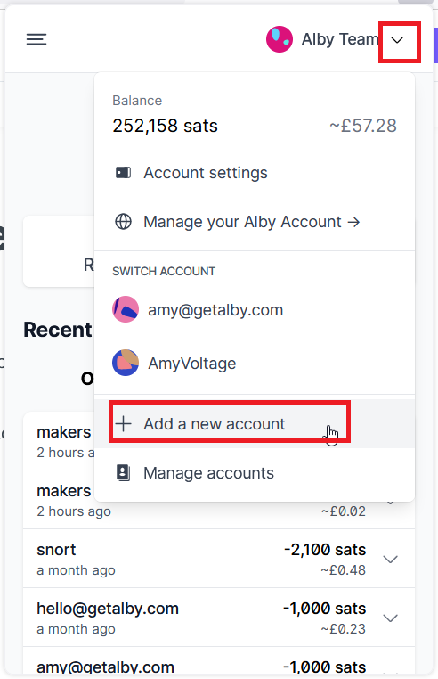
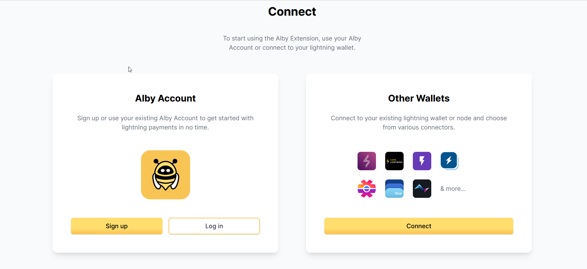
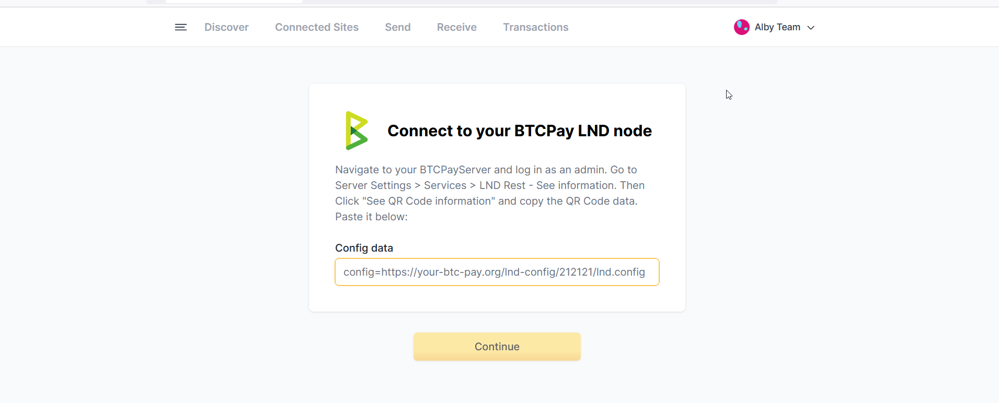

# BTCPay Server

**You have the Alby Browser Extension downloaded and installed**

**Step 1: Open the extension, click on the account menu (top right) and select 'Add Account'**

<figure><figcaption></figcaption></figure>

**Step 2: Choose 'Other Wallets' and then choose BTCPay Server.**

<figure><figcaption></figcaption></figure>

**Step 4: Enter Config data in the relevant field.**

<figure><figcaption></figcaption></figure>

* Navigate to your BTCPayServer and log in as an admin.&#x20;
* Go to Server Settings > Services > LND Rest - See information.&#x20;
* Then Click "See QR Code information" and copy the QR Code data. &#x20;

**Step 4: You will now have your BTC Pay Server connected to Alby and ready to send Bitcoin seamlessly.**:tada:
