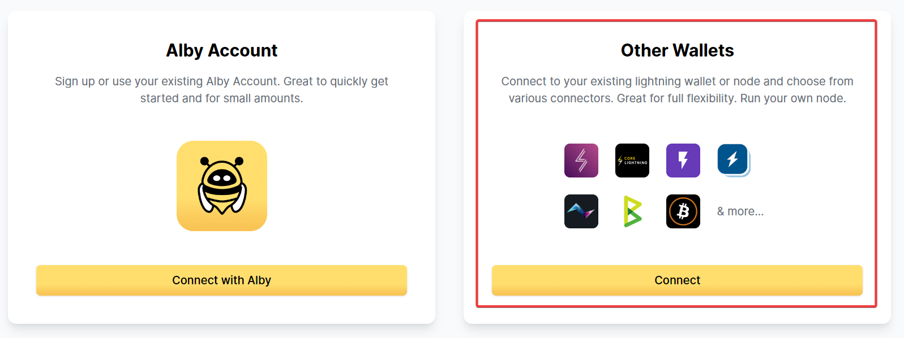

# No limits - quick & easy

You can use the Alby Browser Extension without limits in a non-custodial way. \
This is the quick & easy way

**Step 1:** [Sign up](https://voltage.cloud/nodes/) for a Voltage Lightning account and create a lightning node.

.png>)

**Step 2:** In Voltage, click the "Connect" tab and in the dropdown pick "Alby". Then follow the instructions to create a new Alby account connected to your Lightning node.

**1)** [Install the Alby Browser Extension](https://getalby.com/alby-extension) in your browser and add your new Voltage node

**2)** Click "Connect" to "Other Wallets"&#x20;

<figure><figcaption></figcaption></figure>

**3)** Select LND

<figure><figcaption></figcaption></figure>

&#x20;**4)** Enter the credentials provided by Voltage

<figure><figcaption></figcaption></figure>

Click on "Continue". **Congrats** you successfully connected your own to the Alby Extension 🚀&#x20;

<figure><figcaption></figcaption></figure>

**Step 4:** If you don't have a lightning channel yet, you can follow [**this setup wizard**](https://getalby.github.io/lnd-onboarding/) to fund your node and open your first channel to send and receive bitcoin payments.&#x20;

**Congrats** you are almost ready to spend from your own node with the Alby Extension 🚀

If you need help, send us an [email](mailto:support@getalby.com) anytime!&#x20;
